# Vorher/Nachher: v1 ↔ v2

Erzeugt mit `npm run v2:vergleich`. Links v1 (`src/landingPageGenerator.js`), rechts v2
(`v2/output/sites/`), gleicher synthetischer Test-Lead, gleiche Küche und Stimmung. Aufnahme:
erster Bildschirm, Desktop 1440×900 und Mobil 390×844 (verkleinert), Bewegung aus.

Die Noten stammen vom Design-Judge (`v2/judge/designJudge.js`), angewandt auf **beide**
Seiten mit denselben Regeln. Farben und Schriften von v1 werden gegen die **eigene** v1-Palette
gemessen, nicht gegen die v2-Palette. Raster, Kontrast, Touch-Ziele und verbotene Muster
gelten für beide gleich. Für v1 ist das streng, weil v1 nie gegen diese Regeln gebaut wurde.
Die Noten zeigen, *welche* Regeln v2 zusätzlich einhält, und sind kein Geschmacksurteil über v1.
Grenze der Messung: Kontrast wird gegen den ersten deckenden Hintergrund gemessen. Heller
Text auf einem Foto (v1-Hero, v1-Navigation über dem Foto) zählt deshalb als Kontrastfehler,
auch wenn ein dunkler Schleier ihn im Bild lesbar macht. v2 setzt keinen Text auf Fotos.

## Überblick

| | v1 | v2 |
|---|---|---|
| Mittlere Judge-Note | 6.0 | 10.0 |
| Judge bestanden | 0 / 36 | 36 / 36 |

| Kombination | Hero v2 | Farbe v1→v2 | Typo v1→v2 | Rhythmus v1→v2 | Bild v1→v2 | Muster v1→v2 | Mittel v1→v2 |
|---|---|---|---|---|---|---|---|
| [Bayerisch · Wirtshaus](#bayerisch--wirtshaus) | passepartout | 2→10 | 10→10 | 6→10 | 10→10 | 0→10 | 5.6 ✗→10.0 |
| [Bayerisch · Kellerstube](#bayerisch--kellerstube) | passepartout | 8.5→10 | 10→10 | 6→10 | 7.5→10 | 0→10 | 6.4 ✗→10.0 |
| [Bayerisch · Biergarten](#bayerisch--biergarten) | streifen | 2→10 | 10→10 | 8→10 | 9→10 | 0→10 | 5.8 ✗→10.0 |
| [Italienisch · Trattoria](#italienisch--trattoria) | tafel | 3.5→10 | 10→10 | 6→10 | 10→10 | 0→10 | 5.9 ✗→10.0 |
| [Italienisch · Osteria Notte](#italienisch--osteria-notte) | spalte-bild | 10→10 | 10→10 | 6→10 | 4→10 | 0→10 | 6.0 ✗→10.0 |
| [Italienisch · Costiera](#italienisch--costiera) | streifen | 3.5→10 | 10→10 | 8→10 | 9→10 | 0→10 | 6.1 ✗→10.0 |
| [Griechisch · Taverne am Hafen](#griechisch--taverne-am-hafen) | tafel | 3.5→10 | 10→10 | 6→10 | 10→10 | 0→10 | 5.9 ✗→10.0 |
| [Griechisch · Athener Moderne](#griechisch--athener-moderne) | tafel | 8.5→10 | 10→10 | 6→10 | 4.5→10 | 0→10 | 5.8 ✗→10.0 |
| [Griechisch · Olivenhain](#griechisch--olivenhain) | streifen | 3.5→10 | 10→10 | 8→10 | 9→10 | 0→10 | 6.1 ✗→10.0 |
| [Türkisch · Basar](#tuerkisch--basar) | passepartout | 3.5→10 | 10→10 | 6→10 | 10→10 | 0→10 | 5.9 ✗→10.0 |
| [Türkisch · Bosporus bei Nacht](#tuerkisch--bosporus-nacht) | spalte-bild | 10→10 | 10→10 | 6→10 | 4.5→10 | 0→10 | 6.1 ✗→10.0 |
| [Türkisch · Anatolische Erde](#tuerkisch--anatolische-erde) | streifen | 3.5→10 | 10→10 | 4→10 | 9→10 | 0→10 | 5.3 ✗→10.0 |
| [Syrisch · Damaszener Hof](#syrisch--damaszener-hof) | tafel | 3.5→10 | 10→10 | 6→10 | 10→10 | 0→10 | 5.9 ✗→10.0 |
| [Syrisch · Gewürzbasar](#syrisch--gewuerzbasar) | typo | 8.5→10 | 10→10 | 6→10 | 4.5→10 | 0→10 | 5.8 ✗→10.0 |
| [Syrisch · Levante Modern](#syrisch--levante-modern) | typo | 3.5→10 | 10→10 | 8→10 | 9→10 | 0→10 | 6.1 ✗→10.0 |
| [Chinesisch · Rote Laterne](#chinesisch--rote-laterne) | tafel | 3.5→10 | 10→10 | 6→10 | 10→10 | 0→10 | 5.9 ✗→10.0 |
| [Chinesisch · Shanghai Nacht](#chinesisch--shanghai-nacht) | spalte-bild | 10→10 | 10→10 | 6→10 | 7.5→10 | 0→10 | 6.7 ✗→10.0 |
| [Chinesisch · Teehaus](#chinesisch--teehaus) | spalte-bild | 3.5→10 | 10→10 | 8→10 | 9→10 | 0→10 | 6.1 ✗→10.0 |
| [Thailändisch · Orchidee](#thailaendisch--orchidee) | spalte-bild | 3.5→10 | 10→10 | 6→10 | 10→10 | 0→10 | 5.9 ✗→10.0 |
| [Thailändisch · Streetfood Nacht](#thailaendisch--streetfood-nacht) | tafel | 8.5→10 | 10→10 | 6→10 | 4.5→10 | 0→10 | 5.8 ✗→10.0 |
| [Thailändisch · Andamanen](#thailaendisch--andamanen) | typo | 3.5→10 | 10→10 | 8→10 | 9→10 | 0→10 | 6.1 ✗→10.0 |
| [Vietnamesisch · Indochine](#vietnamesisch--indochine) | karte | 3.5→10 | 10→10 | 6→10 | 10→7 | 0→10 | 5.9 ✗→9.4 |
| [Vietnamesisch · Hanoi Nacht](#vietnamesisch--hanoi-nacht) | tafel | 8.5→10 | 10→10 | 6→10 | 4.5→10 | 0→10 | 5.8 ✗→10.0 |
| [Vietnamesisch · Straßenküche](#vietnamesisch--strassenkueche) | typo | 3.5→10 | 10→10 | 8→10 | 9→10 | 0→10 | 6.1 ✗→10.0 |
| [Japanisch · Izakaya](#japanisch--izakaya) | spalte-bild | 10→10 | 10→10 | 6→10 | 10→10 | 0→10 | 7.2 ✗→10.0 |
| [Japanisch · Omakase](#japanisch--omakase) | spalte-bild | 7→10 | 10→10 | 6→10 | 9→10 | 0→10 | 6.4 ✗→10.0 |
| [Japanisch · Washitsu](#japanisch--washitsu) | streifen | 3.5→10 | 10→10 | 8→10 | 9→10 | 0→10 | 6.1 ✗→10.0 |
| [Indisch · Gewürzmarkt](#indisch--gewuerzmarkt) | spalte-bild | 3.5→10 | 10→10 | 6→10 | 10→10 | 0→10 | 5.9 ✗→10.0 |
| [Indisch · Maharadscha](#indisch--maharadscha) | typo | 10→10 | 10→10 | 6→10 | 4.5→10 | 0→10 | 6.1 ✗→10.0 |
| [Indisch · Südindisch hell](#indisch--suedindisch-hell) | streifen | 3.5→10 | 10→10 | 8→10 | 9→10 | 0→10 | 6.1 ✗→10.0 |
| [Asiatisch (gemischt) · Marktstand](#asiatisch--marktstand) | karte | 3.5→10 | 10→10 | 6→10 | 10→7 | 0→10 | 5.9 ✗→9.4 |
| [Asiatisch (gemischt) · Neon](#asiatisch--neon) | spalte-bild | 10→10 | 10→10 | 6→10 | 4→10 | 0→10 | 6.0 ✗→10.0 |
| [Asiatisch (gemischt) · Fusion Minimal](#asiatisch--fusion-minimal) | spalte-bild | 3.5→10 | 10→10 | 8→10 | 9→10 | 0→10 | 6.1 ✗→10.0 |
| [Café · Wiener Kaffeehaus](#cafe--wiener-kaffeehaus) | passepartout | 3.5→10 | 10→10 | 6→10 | 10→10 | 0→10 | 5.9 ✗→10.0 |
| [Café · Konditorei](#cafe--konditorei) | spalte-bild | 5→10 | 10→10 | 6→10 | 6→10 | 0→10 | 5.4 ✗→10.0 |
| [Café · Third Wave](#cafe--third-wave) | streifen | 3.5→10 | 10→10 | 8→10 | 9→10 | 0→10 | 6.1 ✗→10.0 |

## Alle 36 Kombinationen

### Bayerisch · Wirtshaus

v2: Traditionell, Vollkorn / Alegreya Sans, Hero „passepartout“, Akzent `#3f5d3a`. Judge v1 5.6 ✗ → v2 10.0.

| v1 (vorher) | v2 (nachher) |
|---|---|
| 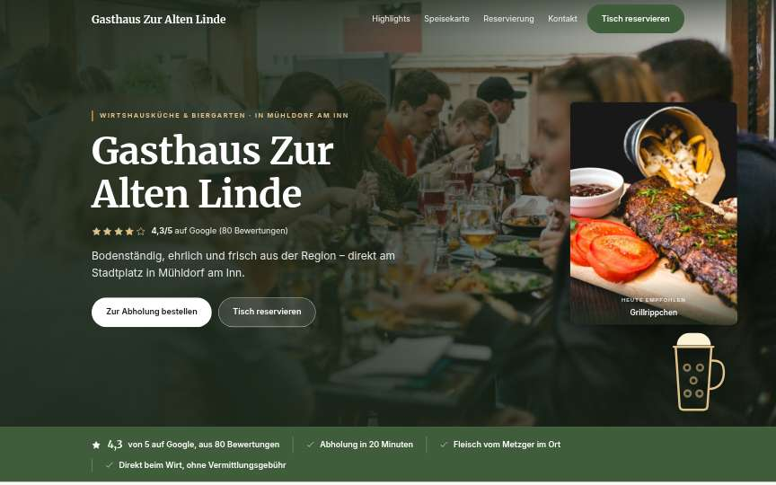 | 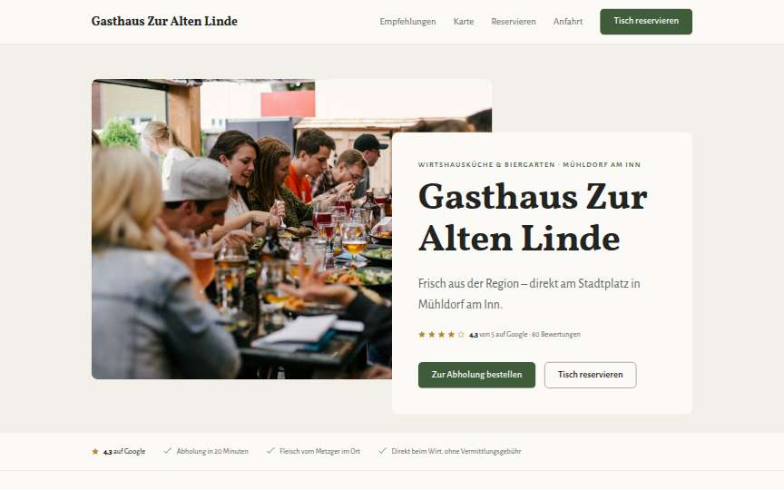 |
| 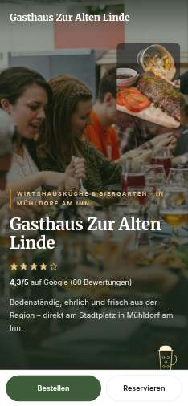 | 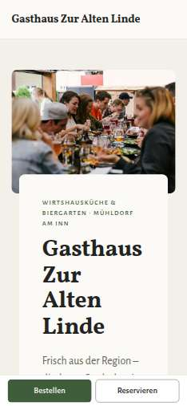 |

Judge-Befunde v1:
  - 2 Farbe(n) außerhalb der Palette: rgb(253,243,214), rgb(26,26,26)
  - 4 Text(e) unter WCAG-AA im gerenderten Ergebnis: „Highlights“ 1.04:1, „Speisekarte“ 1.04:1, „Reservierung“ 1.04:1
  - 3 Sektion(en) mit Abstand außerhalb der Skala
  - 15 Bedienelement(e) auf dem Handy unter 40px Höhe

### Bayerisch · Kellerstube

v2: Abend, Young Serif / Alegreya Sans, Hero „passepartout“, Akzent `#9b4d37`. Judge v1 6.4 ✗ → v2 10.0.

| v1 (vorher) | v2 (nachher) |
|---|---|
| 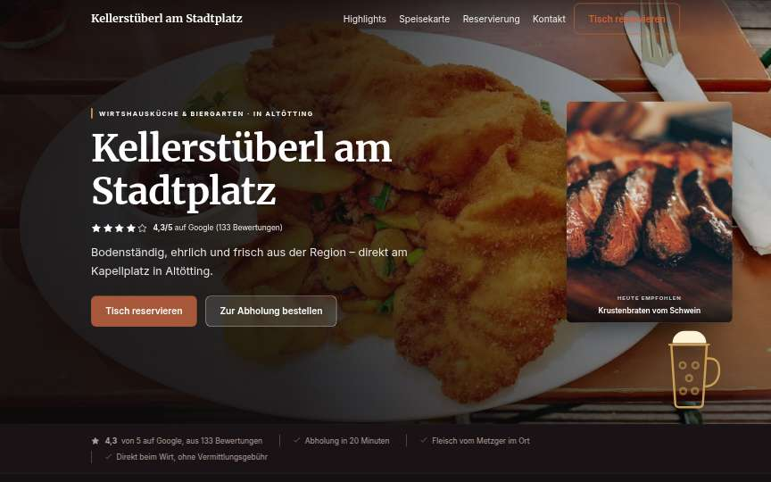 | 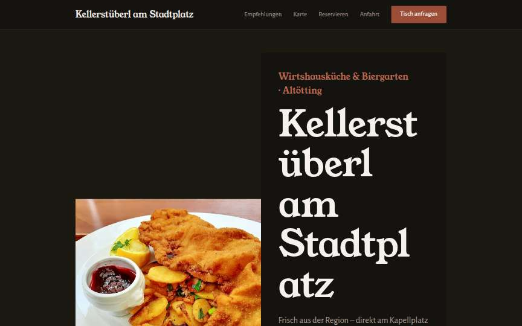 |
| 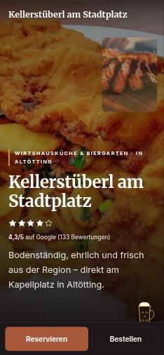 | 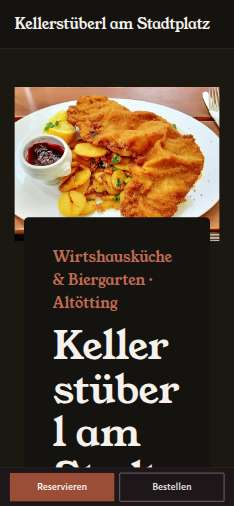 |

Judge-Befunde v1:
  - 1 Farbe(n) außerhalb der Palette: rgb(253,243,214)
  - 5 Sektion(en) mit Abstand außerhalb der Skala
  - 15 Bedienelement(e) auf dem Handy unter 40px Höhe
  - 1 Bild(er) nicht geladen

### Bayerisch · Biergarten

v2: Hell & modern, Fraunces / Figtree, Hero „streifen“, Akzent `#749841`. Judge v1 5.8 ✗ → v2 10.0.

| v1 (vorher) | v2 (nachher) |
|---|---|
| 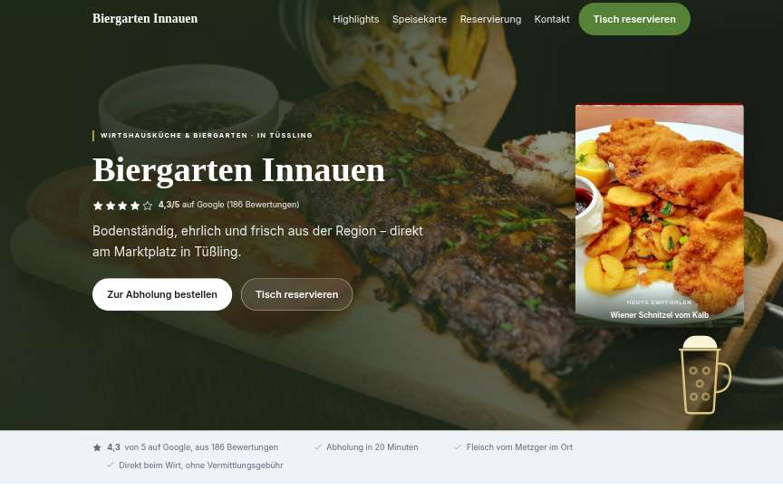 | 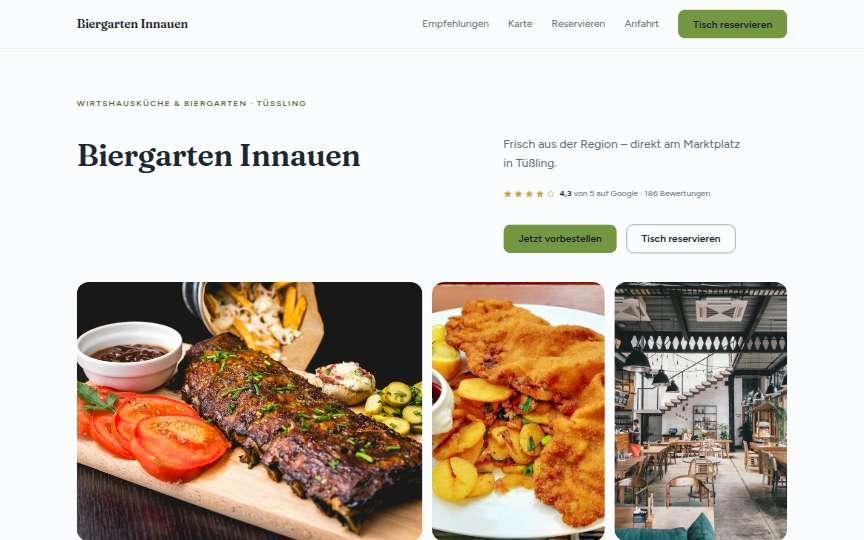 |
| 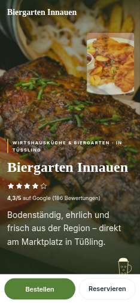 | 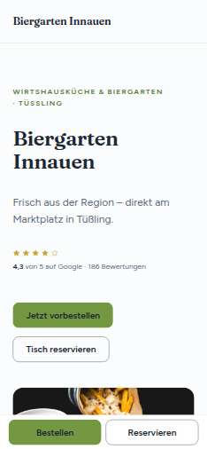 |

Judge-Befunde v1:
  - 2 Farbe(n) außerhalb der Palette: rgb(253,243,214), rgb(26,26,26)
  - 4 Text(e) unter WCAG-AA im gerenderten Ergebnis: „Highlights“ 1.03:1, „Speisekarte“ 1.03:1, „Reservierung“ 1.03:1
  - 15 Bedienelement(e) auf dem Handy unter 40px Höhe
  - 1 Bild(er) hochskaliert (unscharf)

### Italienisch · Trattoria

v2: Traditionell, EB Garamond / Karla, Hero „tafel“, Akzent `#a43d1e`. Judge v1 5.9 ✗ → v2 10.0.

| v1 (vorher) | v2 (nachher) |
|---|---|
| 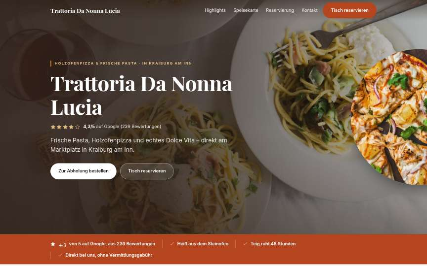 | 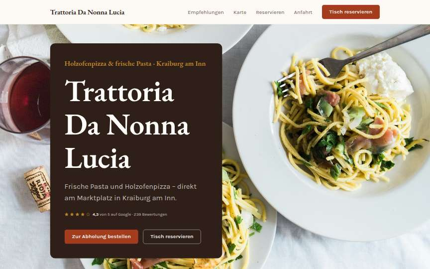 |
|  | 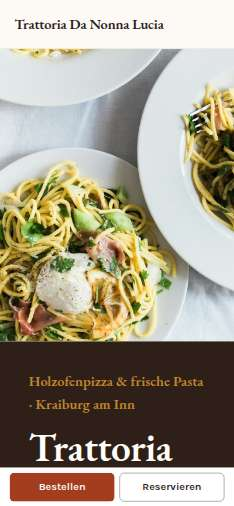 |

Judge-Befunde v1:
  - 1 Farbe(n) außerhalb der Palette: rgb(26,26,26)
  - 4 Text(e) unter WCAG-AA im gerenderten Ergebnis: „Highlights“ 1.04:1, „Speisekarte“ 1.04:1, „Reservierung“ 1.04:1
  - 3 Sektion(en) mit Abstand außerhalb der Skala
  - 19 Bedienelement(e) auf dem Handy unter 40px Höhe

### Italienisch · Osteria Notte

v2: Abend, Bodoni Moda / Instrument Sans, Hero „spalte-bild“, Akzent `#ab3946`. Judge v1 6.0 ✗ → v2 10.0.

| v1 (vorher) | v2 (nachher) |
|---|---|
| 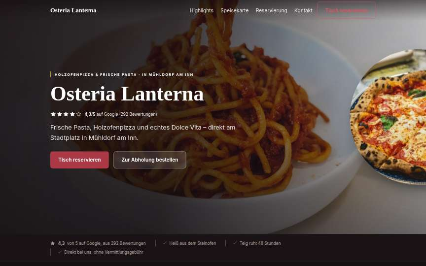 | 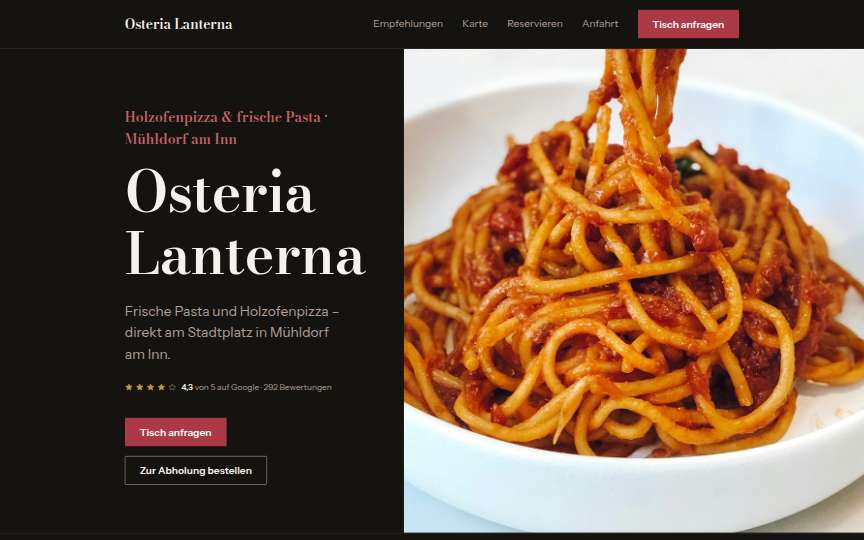 |
| 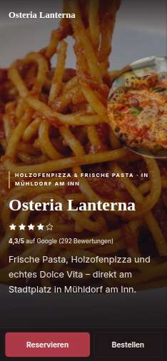 | 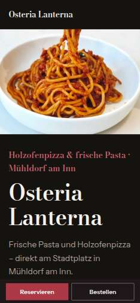 |

Judge-Befunde v1:
  - 5 Sektion(en) mit Abstand außerhalb der Skala
  - 19 Bedienelement(e) auf dem Handy unter 40px Höhe
  - 5 Bild(er) nicht geladen
  - 1 Bild(er) hochskaliert (unscharf)

### Italienisch · Costiera

v2: Hell & modern, Italiana / Figtree, Hero „streifen“, Akzent `#356d8d`. Judge v1 6.1 ✗ → v2 10.0.

| v1 (vorher) | v2 (nachher) |
|---|---|
| 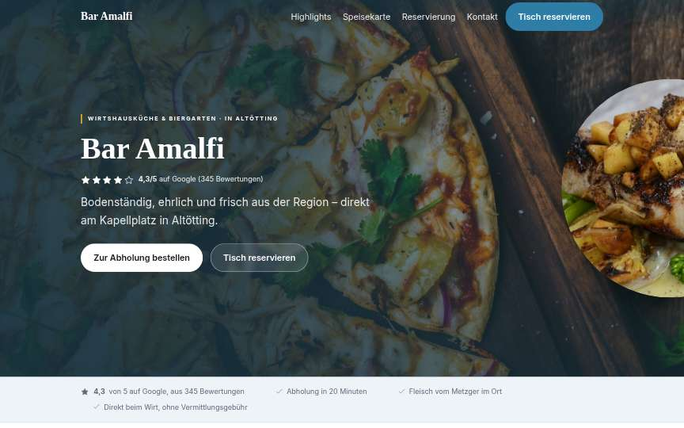 | 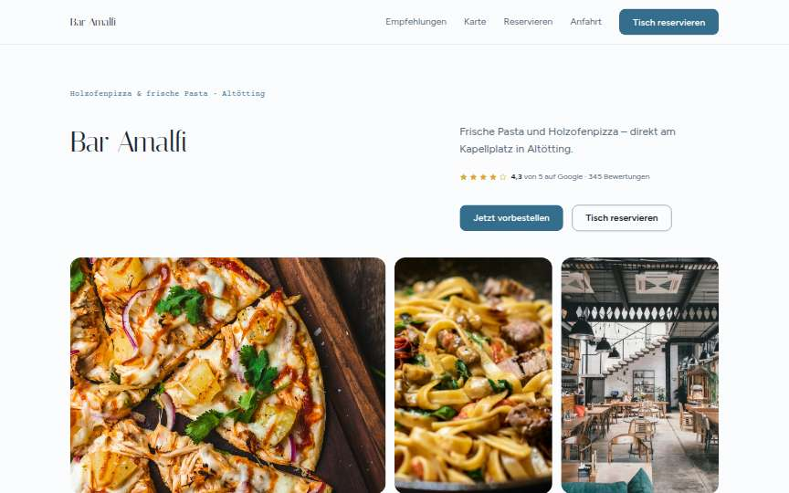 |
| 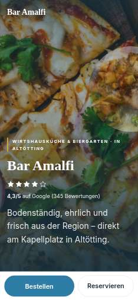 | 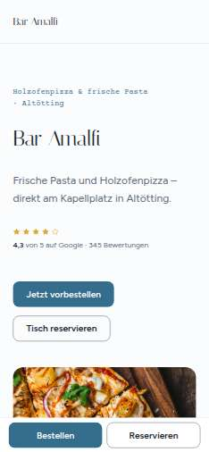 |

Judge-Befunde v1:
  - 1 Farbe(n) außerhalb der Palette: rgb(26,26,26)
  - 4 Text(e) unter WCAG-AA im gerenderten Ergebnis: „Highlights“ 1.03:1, „Speisekarte“ 1.03:1, „Reservierung“ 1.03:1
  - 15 Bedienelement(e) auf dem Handy unter 40px Höhe
  - 1 Bild(er) hochskaliert (unscharf)

### Griechisch · Taverne am Hafen

v2: Traditionell, Marcellus / Hanken Grotesk, Hero „tafel“, Akzent `#237793`. Judge v1 5.9 ✗ → v2 10.0.

| v1 (vorher) | v2 (nachher) |
|---|---|
| 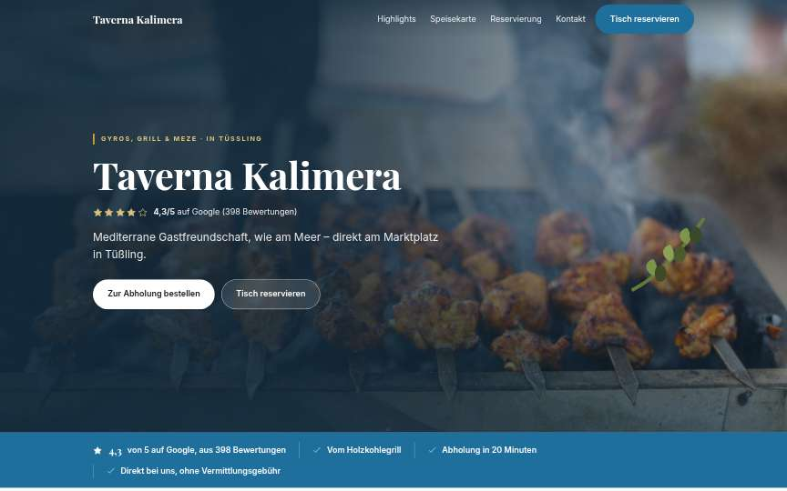 | 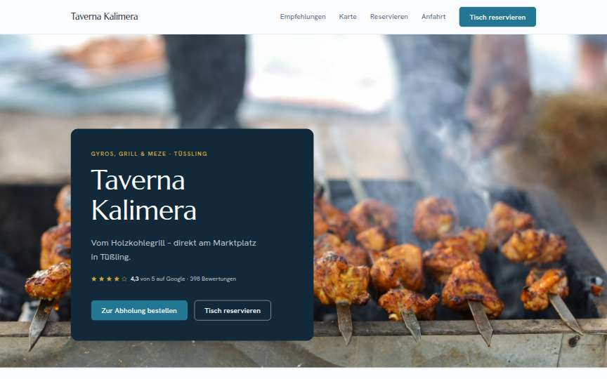 |
| 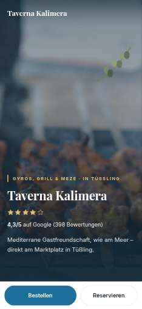 | 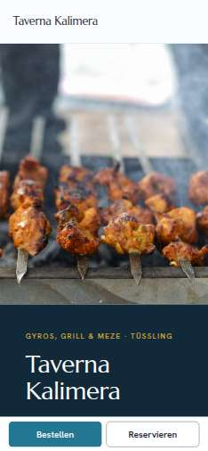 |

Judge-Befunde v1:
  - 1 Farbe(n) außerhalb der Palette: rgb(26,26,26)
  - 4 Text(e) unter WCAG-AA im gerenderten Ergebnis: „Highlights“ 1.03:1, „Speisekarte“ 1.03:1, „Reservierung“ 1.03:1
  - 3 Sektion(en) mit Abstand außerhalb der Skala
  - 13 Bedienelement(e) auf dem Handy unter 40px Höhe

### Griechisch · Athener Moderne

v2: Abend, Tenor Sans / Instrument Sans, Hero „tafel“, Akzent `#bd9d44`. Judge v1 5.8 ✗ → v2 10.0.

| v1 (vorher) | v2 (nachher) |
|---|---|
| 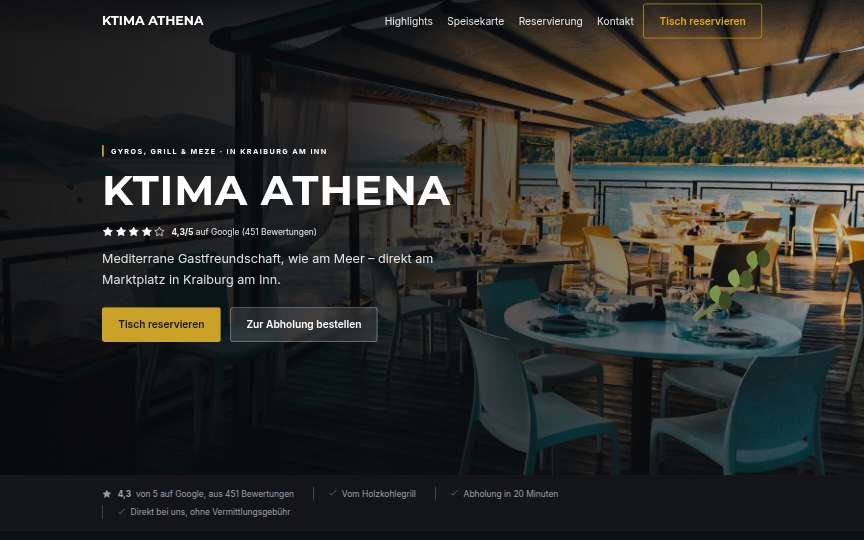 | 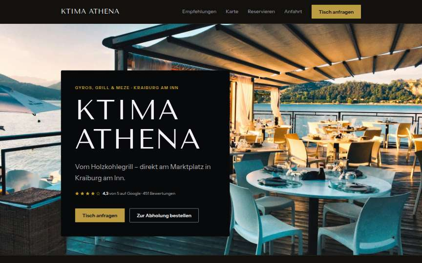 |
| 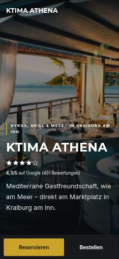 | 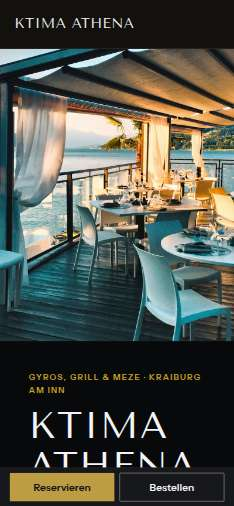 |

Judge-Befunde v1:
  - 1 Farbe(n) außerhalb der Palette: rgb(255,255,255)
  - 5 Sektion(en) mit Abstand außerhalb der Skala
  - 13 Bedienelement(e) auf dem Handy unter 40px Höhe
  - 3 Bild(er) nicht geladen

### Griechisch · Olivenhain

v2: Hell & modern, Cormorant Garamond / Work Sans, Hero „streifen“, Akzent `#799553`. Judge v1 6.1 ✗ → v2 10.0.

| v1 (vorher) | v2 (nachher) |
|---|---|
| 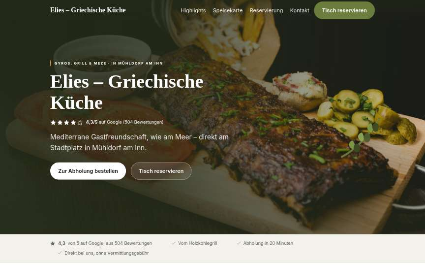 | 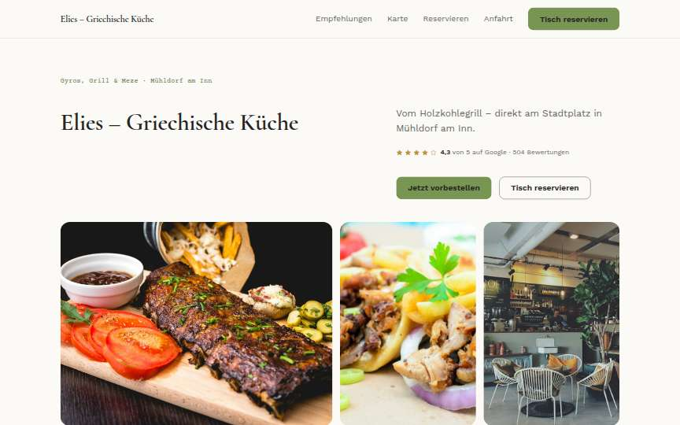 |
| 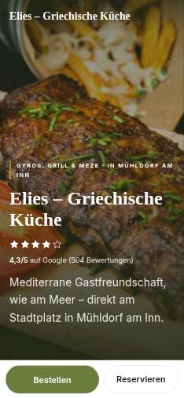 | 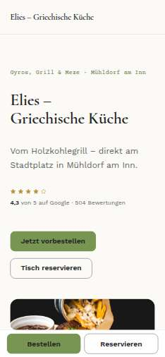 |

Judge-Befunde v1:
  - 1 Farbe(n) außerhalb der Palette: rgb(26,26,26)
  - 4 Text(e) unter WCAG-AA im gerenderten Ergebnis: „Highlights“ 1.04:1, „Speisekarte“ 1.04:1, „Reservierung“ 1.04:1
  - 13 Bedienelement(e) auf dem Handy unter 40px Höhe
  - 1 Bild(er) hochskaliert (unscharf)

### Türkisch · Basar

v2: Traditionell, Barlow Condensed / Work Sans, Hero „passepartout“, Akzent `#c13c2e`. Judge v1 5.9 ✗ → v2 10.0.

| v1 (vorher) | v2 (nachher) |
|---|---|
| 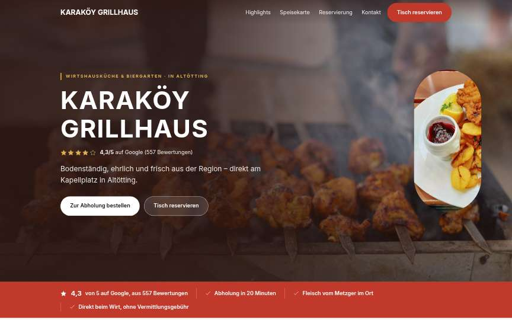 | 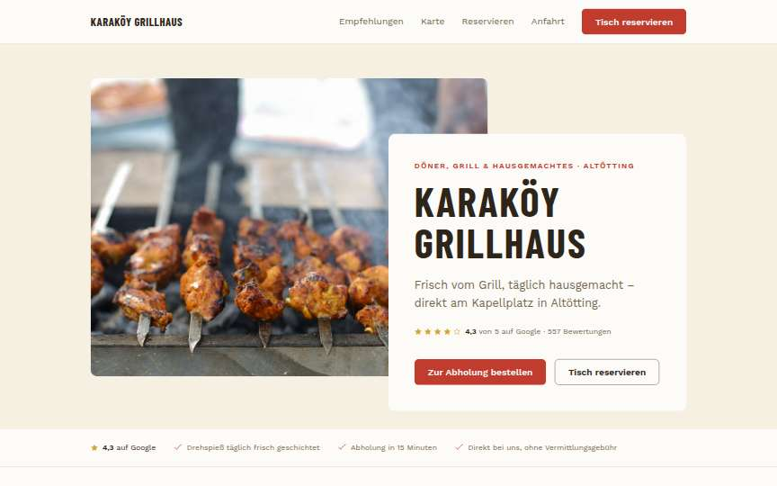 |
| 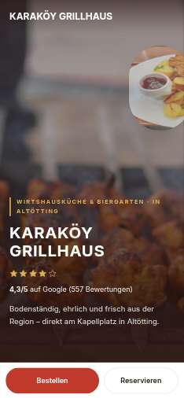 | 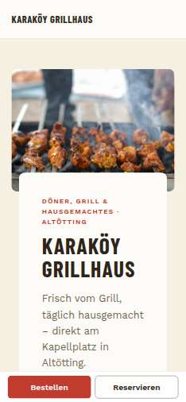 |

Judge-Befunde v1:
  - 1 Farbe(n) außerhalb der Palette: rgb(26,26,26)
  - 4 Text(e) unter WCAG-AA im gerenderten Ergebnis: „Highlights“ 1.03:1, „Speisekarte“ 1.03:1, „Reservierung“ 1.03:1
  - 3 Sektion(en) mit Abstand außerhalb der Skala
  - 15 Bedienelement(e) auf dem Handy unter 40px Höhe

### Türkisch · Bosporus bei Nacht

v2: Abend, Gloock / Instrument Sans, Hero „spalte-bild“, Akzent `#347878`. Judge v1 6.1 ✗ → v2 10.0.

| v1 (vorher) | v2 (nachher) |
|---|---|
| 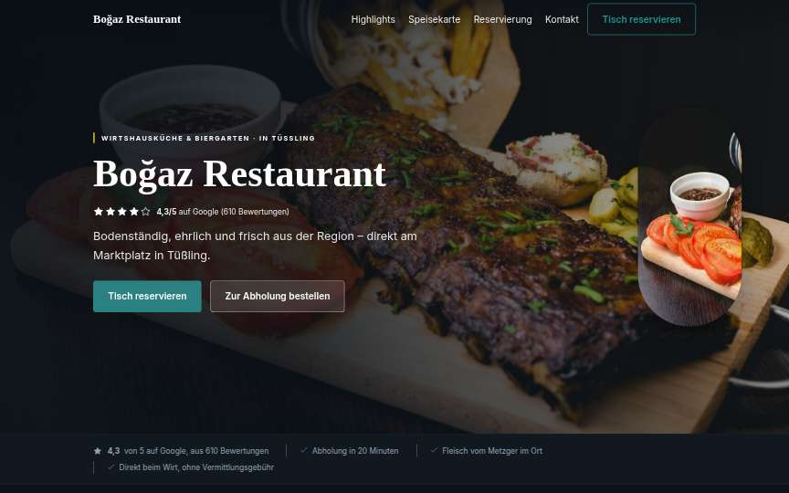 | 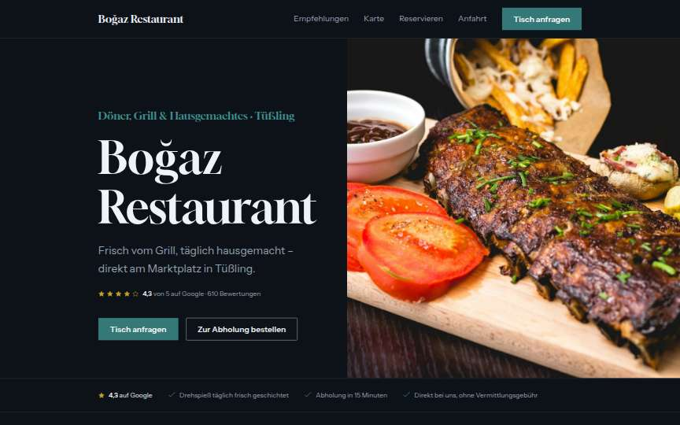 |
| 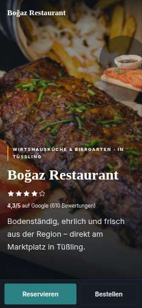 | 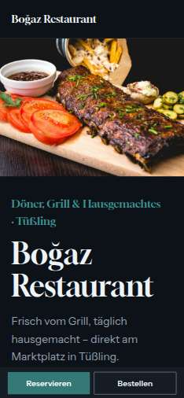 |

Judge-Befunde v1:
  - 5 Sektion(en) mit Abstand außerhalb der Skala
  - 15 Bedienelement(e) auf dem Handy unter 40px Höhe
  - 3 Bild(er) nicht geladen
  - 1 Bild(er) hochskaliert (unscharf)

### Türkisch · Anatolische Erde

v2: Hell & modern, Alegreya / Alegreya Sans, Hero „streifen“, Akzent `#a3663d`. Judge v1 5.3 ✗ → v2 10.0.

| v1 (vorher) | v2 (nachher) |
|---|---|
| 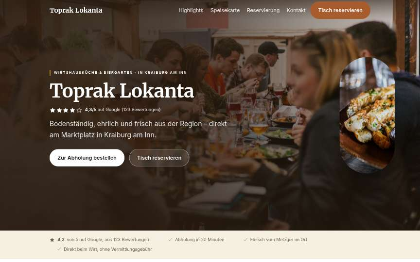 | 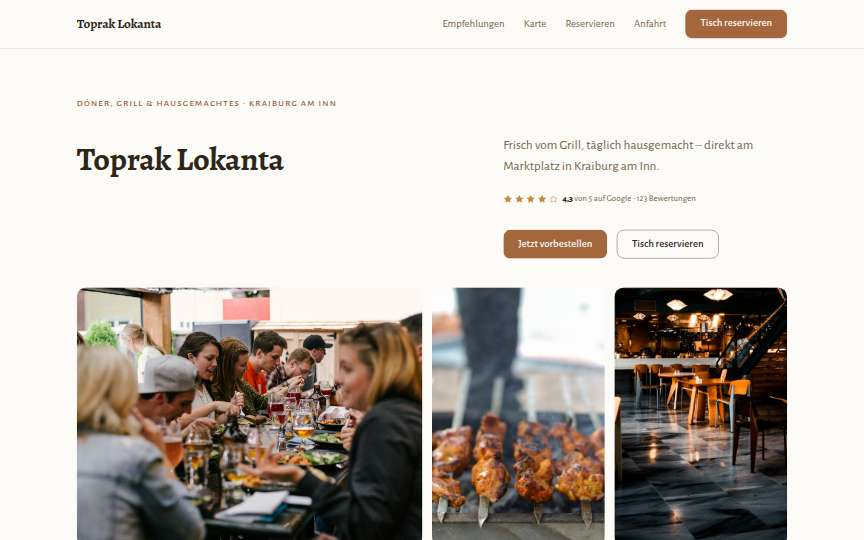 |
| 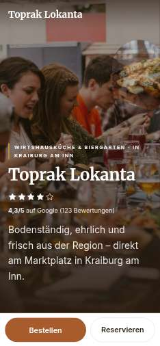 | 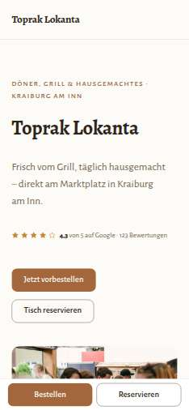 |

Judge-Befunde v1:
  - 1 Farbe(n) außerhalb der Palette: rgb(26,26,26)
  - 4 Text(e) unter WCAG-AA im gerenderten Ergebnis: „Highlights“ 1.03:1, „Speisekarte“ 1.03:1, „Reservierung“ 1.03:1
  - Horizontaler Überlauf auf dem Handy
  - 15 Bedienelement(e) auf dem Handy unter 40px Höhe

### Syrisch · Damaszener Hof

v2: Traditionell, Amiri / Karla, Hero „tafel“, Akzent `#3c8369`. Judge v1 5.9 ✗ → v2 10.0.

| v1 (vorher) | v2 (nachher) |
|---|---|
| 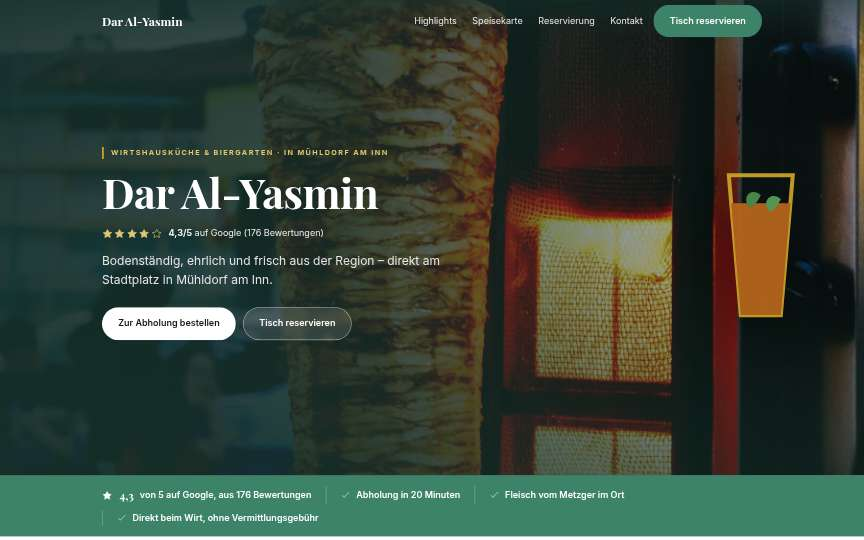 | 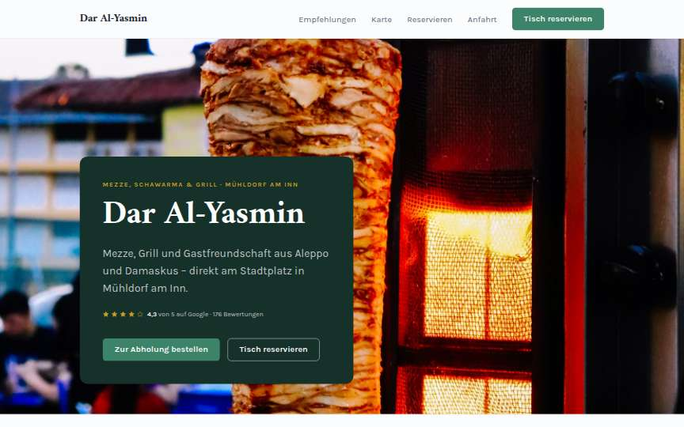 |
| 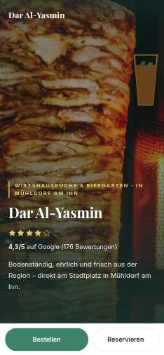 | 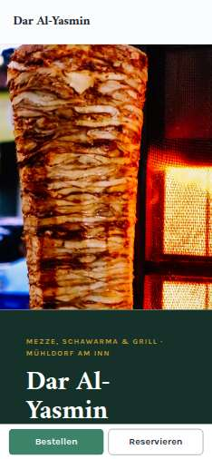 |

Judge-Befunde v1:
  - 1 Farbe(n) außerhalb der Palette: rgb(26,26,26)
  - 4 Text(e) unter WCAG-AA im gerenderten Ergebnis: „Highlights“ 1.03:1, „Speisekarte“ 1.03:1, „Reservierung“ 1.03:1
  - 3 Sektion(en) mit Abstand außerhalb der Skala
  - 15 Bedienelement(e) auf dem Handy unter 40px Höhe

### Syrisch · Gewürzbasar

v2: Abend, Reem Kufi / Instrument Sans, Hero „typo“, Akzent `#cd8226`. Judge v1 5.8 ✗ → v2 10.0.

| v1 (vorher) | v2 (nachher) |
|---|---|
| 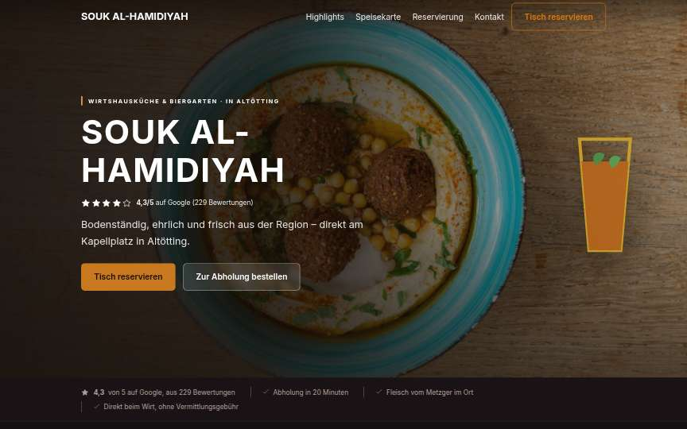 | 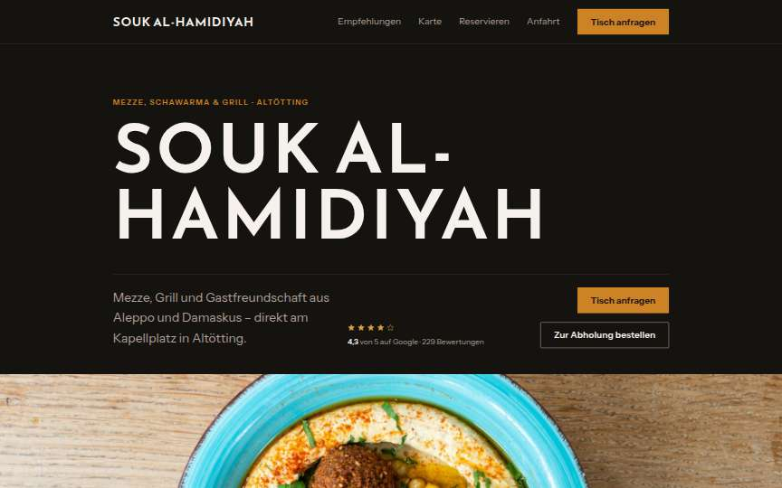 |
| 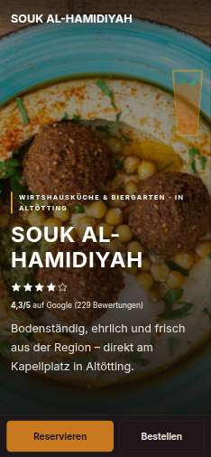 | 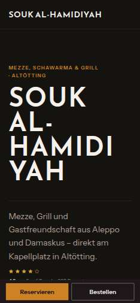 |

Judge-Befunde v1:
  - 1 Farbe(n) außerhalb der Palette: rgb(255,255,255)
  - 5 Sektion(en) mit Abstand außerhalb der Skala
  - 15 Bedienelement(e) auf dem Handy unter 40px Höhe
  - 3 Bild(er) nicht geladen

### Syrisch · Levante Modern

v2: Hell & modern, Libre Caslon Display / Figtree, Hero „typo“, Akzent `#836947`. Judge v1 6.1 ✗ → v2 10.0.

| v1 (vorher) | v2 (nachher) |
|---|---|
| 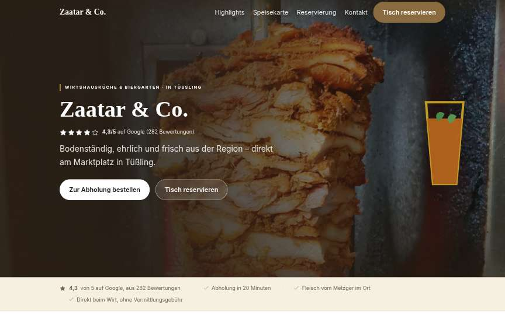 | 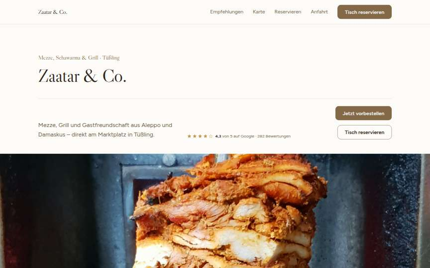 |
| 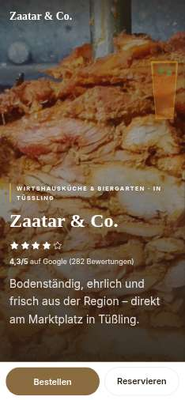 | 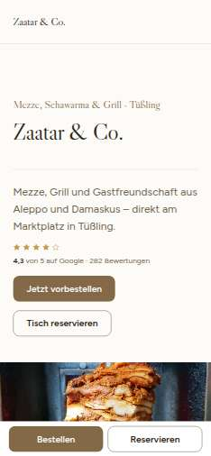 |

Judge-Befunde v1:
  - 1 Farbe(n) außerhalb der Palette: rgb(26,26,26)
  - 4 Text(e) unter WCAG-AA im gerenderten Ergebnis: „Highlights“ 1.03:1, „Speisekarte“ 1.03:1, „Reservierung“ 1.03:1
  - 15 Bedienelement(e) auf dem Handy unter 40px Höhe
  - 1 Bild(er) hochskaliert (unscharf)

### Chinesisch · Rote Laterne

v2: Traditionell, Noto Serif Display / Libre Franklin, Hero „tafel“, Akzent `#b82626`. Judge v1 5.9 ✗ → v2 10.0.

| v1 (vorher) | v2 (nachher) |
|---|---|
| 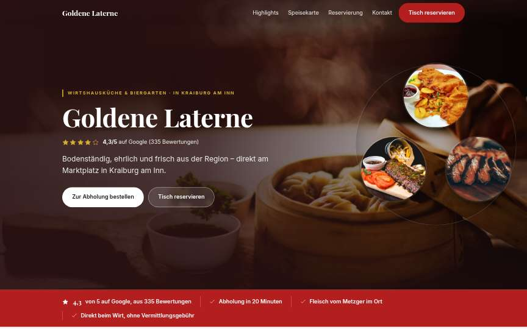 | 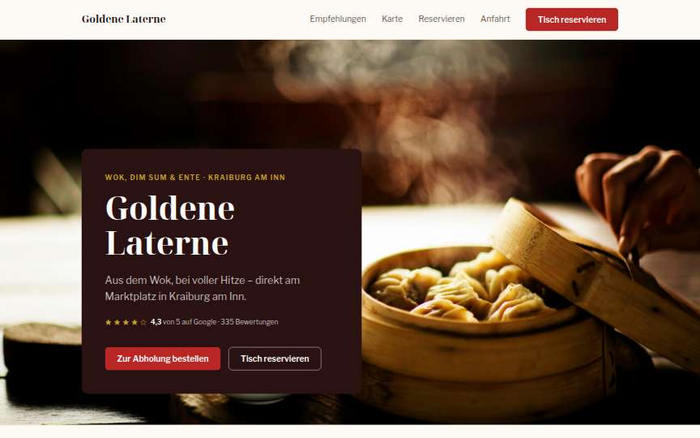 |
| 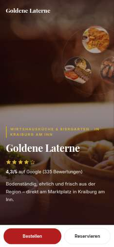 | 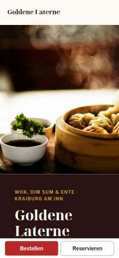 |

Judge-Befunde v1:
  - 1 Farbe(n) außerhalb der Palette: rgb(26,26,26)
  - 4 Text(e) unter WCAG-AA im gerenderten Ergebnis: „Highlights“ 1.04:1, „Speisekarte“ 1.04:1, „Reservierung“ 1.04:1
  - 3 Sektion(en) mit Abstand außerhalb der Skala
  - 15 Bedienelement(e) auf dem Handy unter 40px Höhe

### Chinesisch · Shanghai Nacht

v2: Abend, Poiret One / Instrument Sans, Hero „spalte-bild“, Akzent `#d53c42`. Judge v1 6.7 ✗ → v2 10.0.

| v1 (vorher) | v2 (nachher) |
|---|---|
| 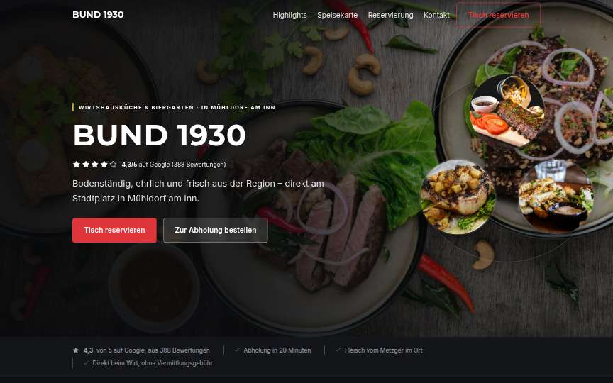 | 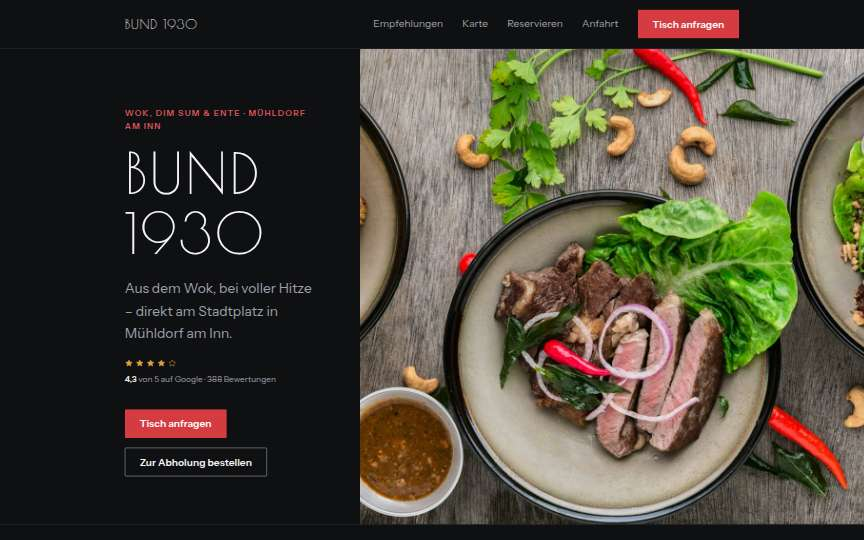 |
| 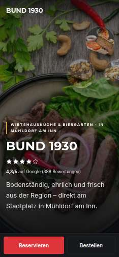 | 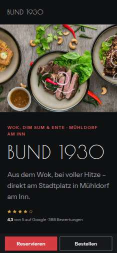 |

Judge-Befunde v1:
  - 5 Sektion(en) mit Abstand außerhalb der Skala
  - 15 Bedienelement(e) auf dem Handy unter 40px Höhe
  - 1 Bild(er) nicht geladen
  - 1 Bild(er) hochskaliert (unscharf)

### Chinesisch · Teehaus

v2: Hell & modern, Gilda Display / Zen Kaku Gothic New, Hero „spalte-bild“, Akzent `#457768`. Judge v1 6.1 ✗ → v2 10.0.

| v1 (vorher) | v2 (nachher) |
|---|---|
| 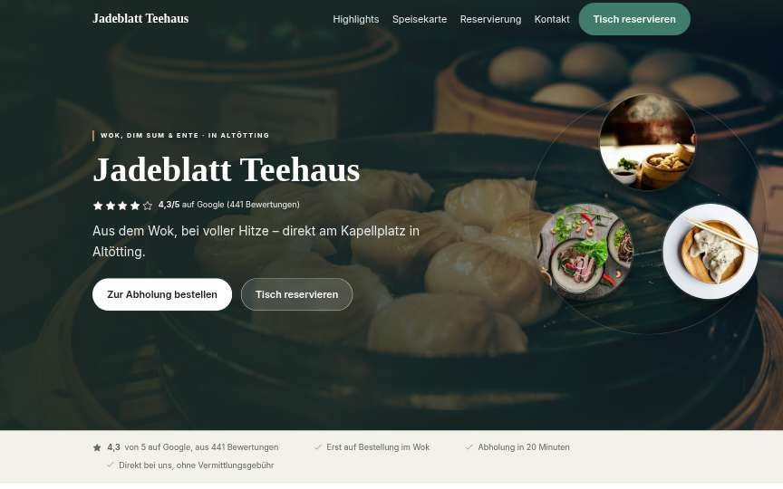 | 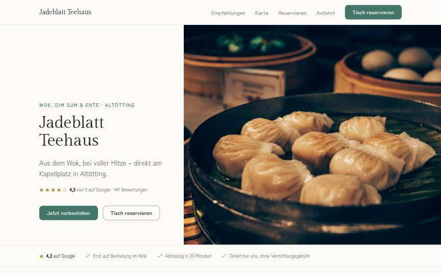 |
| 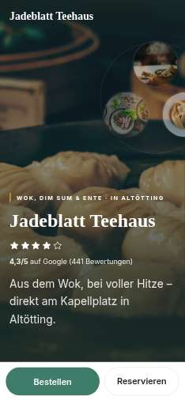 | 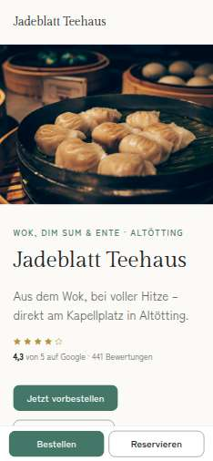 |

Judge-Befunde v1:
  - 1 Farbe(n) außerhalb der Palette: rgb(26,26,26)
  - 4 Text(e) unter WCAG-AA im gerenderten Ergebnis: „Highlights“ 1.04:1, „Speisekarte“ 1.04:1, „Reservierung“ 1.04:1
  - 15 Bedienelement(e) auf dem Handy unter 40px Höhe
  - 1 Bild(er) hochskaliert (unscharf)

### Thailändisch · Orchidee

v2: Traditionell, Yeseva One / Karla, Hero „spalte-bild“, Akzent `#a83c65`. Judge v1 5.9 ✗ → v2 10.0.

| v1 (vorher) | v2 (nachher) |
|---|---|
| 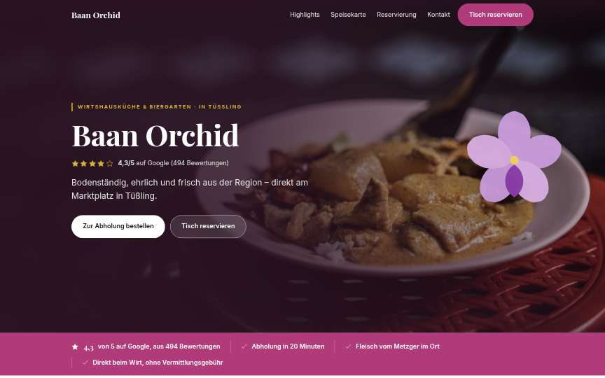 | 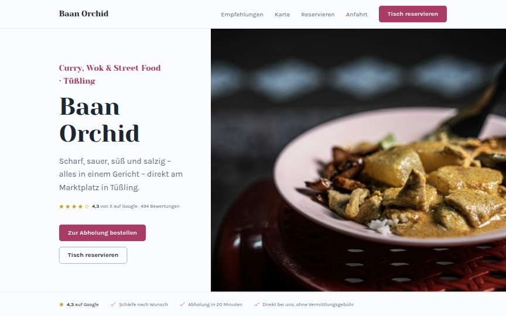 |
| 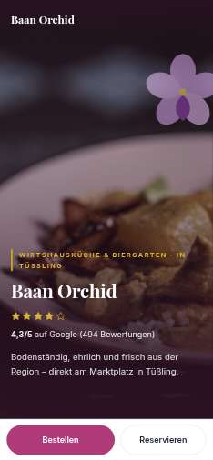 | 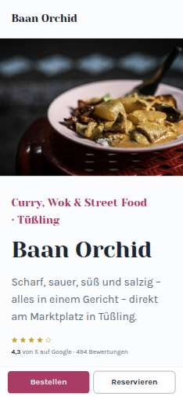 |

Judge-Befunde v1:
  - 1 Farbe(n) außerhalb der Palette: rgb(26,26,26)
  - 4 Text(e) unter WCAG-AA im gerenderten Ergebnis: „Highlights“ 1.03:1, „Speisekarte“ 1.03:1, „Reservierung“ 1.03:1
  - 3 Sektion(en) mit Abstand außerhalb der Skala
  - 15 Bedienelement(e) auf dem Handy unter 40px Höhe

### Thailändisch · Streetfood Nacht

v2: Abend, Big Shoulders Display / Libre Franklin, Hero „tafel“, Akzent `#f58628`. Judge v1 5.8 ✗ → v2 10.0.

| v1 (vorher) | v2 (nachher) |
|---|---|
| 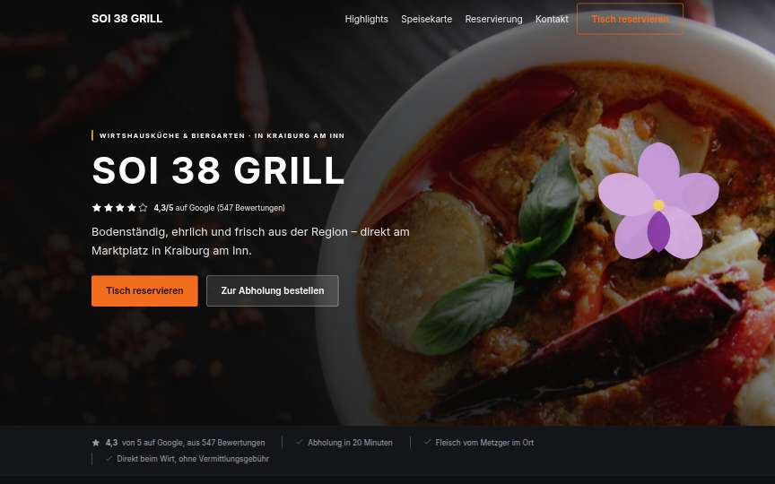 | 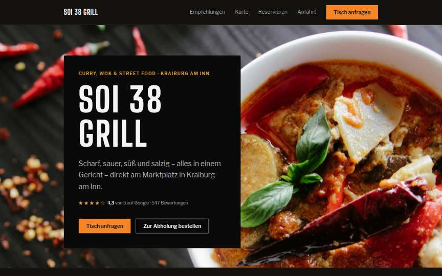 |
| 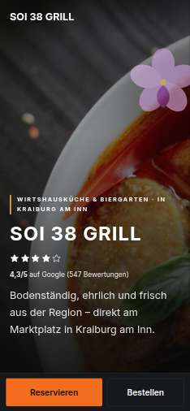 | 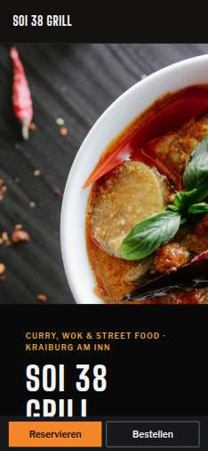 |

Judge-Befunde v1:
  - 1 Farbe(n) außerhalb der Palette: rgb(255,255,255)
  - 5 Sektion(en) mit Abstand außerhalb der Skala
  - 15 Bedienelement(e) auf dem Handy unter 40px Höhe
  - 3 Bild(er) nicht geladen

### Thailändisch · Andamanen

v2: Hell & modern, Newsreader / Figtree, Hero „typo“, Akzent `#247975`. Judge v1 6.1 ✗ → v2 10.0.

| v1 (vorher) | v2 (nachher) |
|---|---|
| 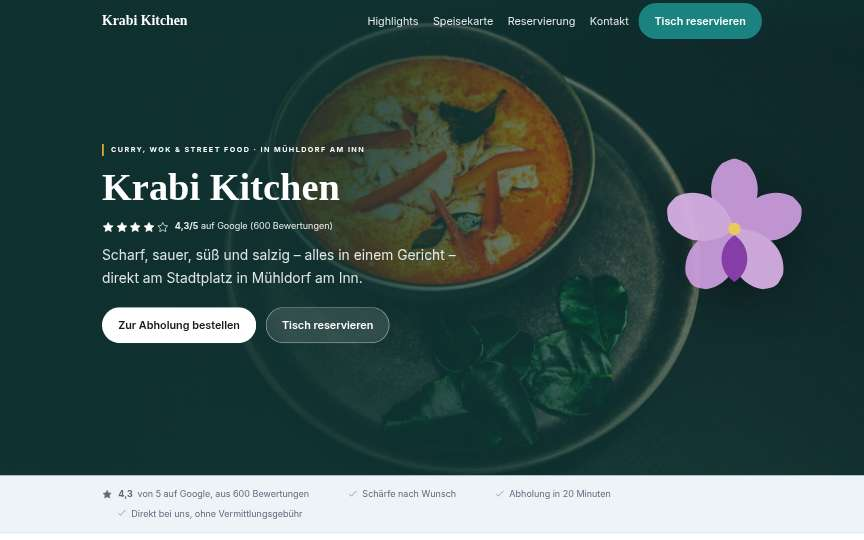 | 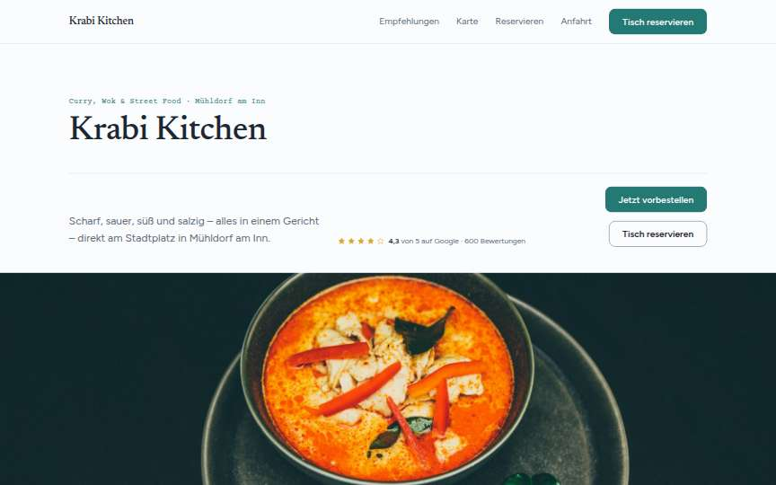 |
| 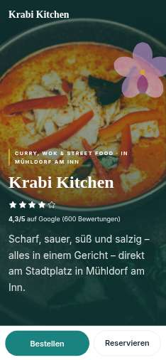 | 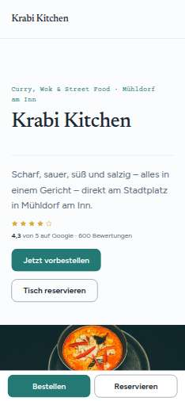 |

Judge-Befunde v1:
  - 1 Farbe(n) außerhalb der Palette: rgb(26,26,26)
  - 4 Text(e) unter WCAG-AA im gerenderten Ergebnis: „Highlights“ 1.03:1, „Speisekarte“ 1.03:1, „Reservierung“ 1.03:1
  - 14 Bedienelement(e) auf dem Handy unter 40px Höhe
  - 1 Bild(er) hochskaliert (unscharf)

### Vietnamesisch · Indochine

v2: Traditionell, Cormorant Garamond / Source Serif 4, Hero „karte“, Akzent `#775330`. Judge v1 5.9 ✗ → v2 9.4.

| v1 (vorher) | v2 (nachher) |
|---|---|
| 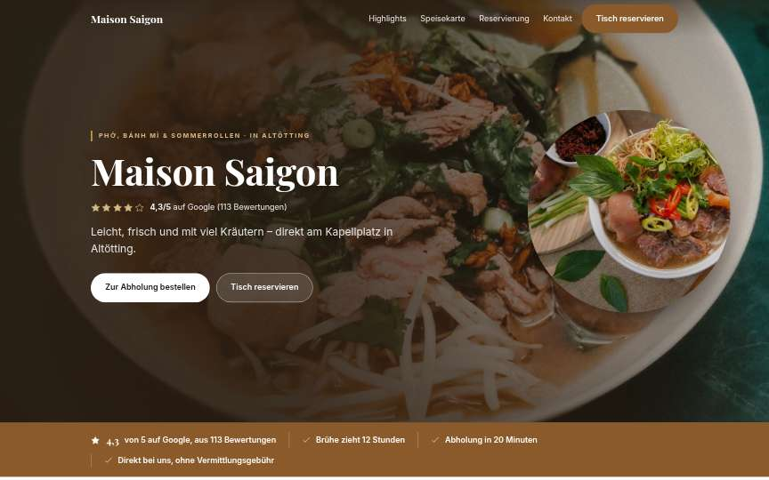 | 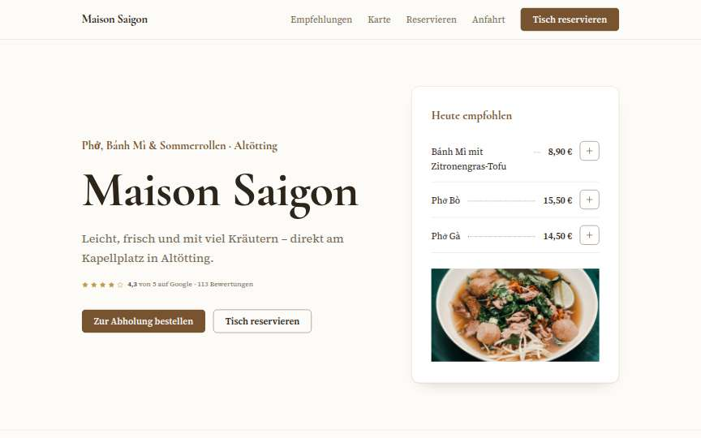 |
| 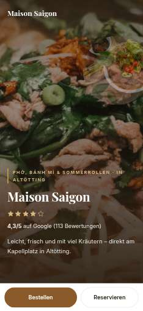 | 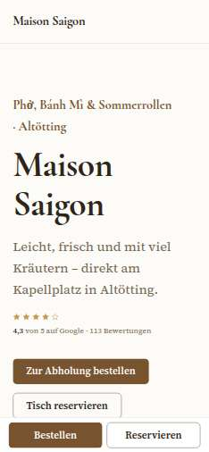 |

Judge-Befunde v1:
  - 1 Farbe(n) außerhalb der Palette: rgb(26,26,26)
  - 4 Text(e) unter WCAG-AA im gerenderten Ergebnis: „Highlights“ 1.03:1, „Speisekarte“ 1.03:1, „Reservierung“ 1.03:1
  - 3 Sektion(en) mit Abstand außerhalb der Skala
  - 14 Bedienelement(e) auf dem Handy unter 40px Höhe

Judge-Befunde v2:
  - Titelbild füllt nur 5 % des ersten Bildschirms

### Vietnamesisch · Hanoi Nacht

v2: Abend, DM Serif Display / Instrument Sans, Hero „tafel“, Akzent `#be8631`. Judge v1 5.8 ✗ → v2 10.0.

| v1 (vorher) | v2 (nachher) |
|---|---|
| 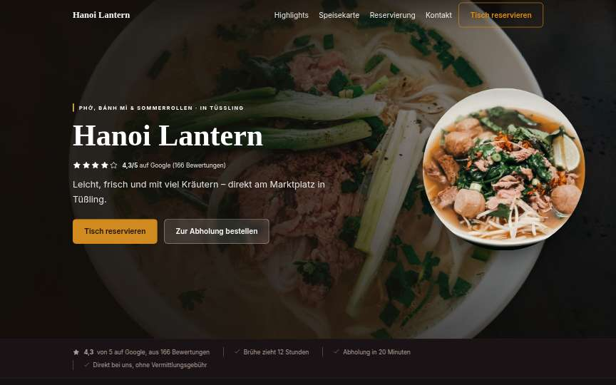 | 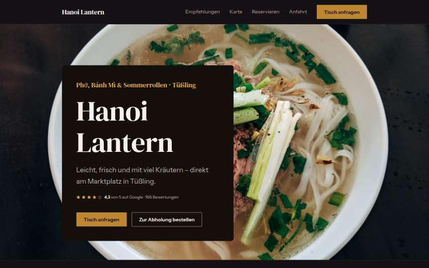 |
| 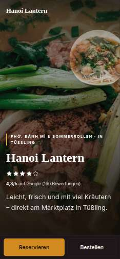 | 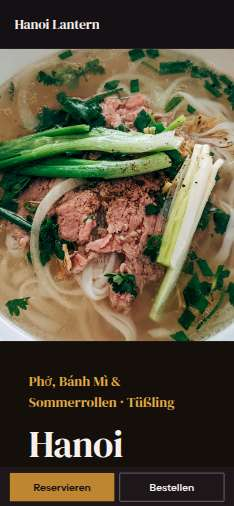 |

Judge-Befunde v1:
  - 1 Farbe(n) außerhalb der Palette: rgb(255,255,255)
  - 5 Sektion(en) mit Abstand außerhalb der Skala
  - 14 Bedienelement(e) auf dem Handy unter 40px Höhe
  - 3 Bild(er) nicht geladen

### Vietnamesisch · Straßenküche

v2: Hell & modern, Chivo / Karla, Hero „typo“, Akzent `#448240`. Judge v1 6.1 ✗ → v2 10.0.

| v1 (vorher) | v2 (nachher) |
|---|---|
| 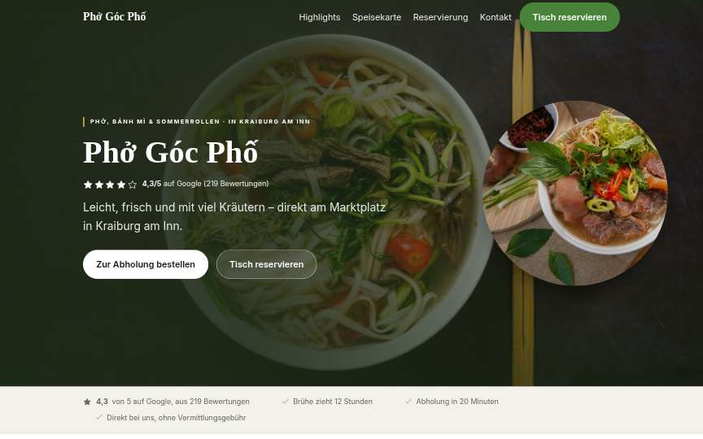 | 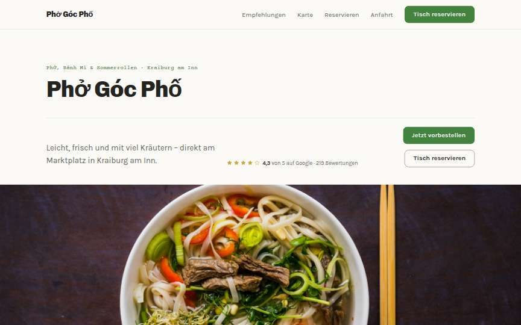 |
| 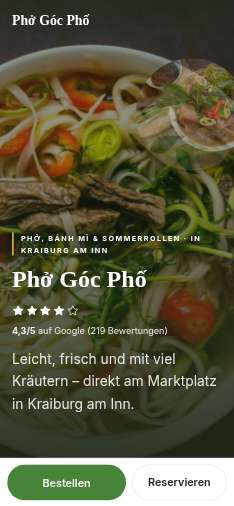 | 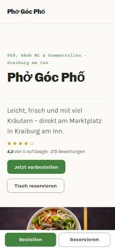 |

Judge-Befunde v1:
  - 1 Farbe(n) außerhalb der Palette: rgb(26,26,26)
  - 4 Text(e) unter WCAG-AA im gerenderten Ergebnis: „Highlights“ 1.04:1, „Speisekarte“ 1.04:1, „Reservierung“ 1.04:1
  - 14 Bedienelement(e) auf dem Handy unter 40px Höhe
  - 1 Bild(er) hochskaliert (unscharf)

### Japanisch · Izakaya

v2: Traditionell, Antonio / Zen Kaku Gothic New, Hero „spalte-bild“, Akzent `#c13732`. Judge v1 7.2 ✗ → v2 10.0.

| v1 (vorher) | v2 (nachher) |
|---|---|
| 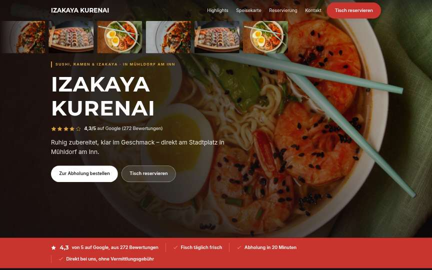 | 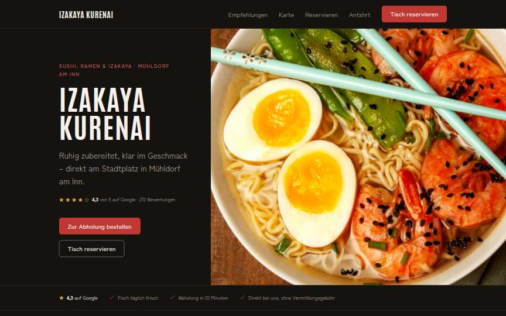 |
| 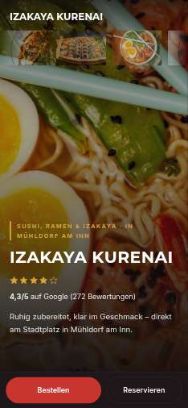 | 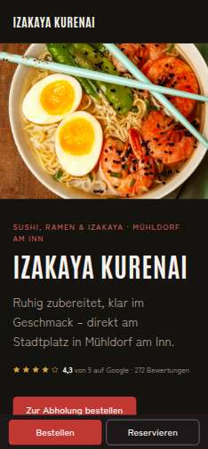 |

Judge-Befunde v1:
  - 3 Sektion(en) mit Abstand außerhalb der Skala
  - 14 Bedienelement(e) auf dem Handy unter 40px Höhe
  - generische-schrift: Inter in @font-face
  - generische-schrift: Inter in @font-face

### Japanisch · Omakase

v2: Abend, Shippori Mincho / Zen Kaku Gothic New, Hero „spalte-bild“, Akzent `#b39b62`. Judge v1 6.4 ✗ → v2 10.0.

| v1 (vorher) | v2 (nachher) |
|---|---|
| 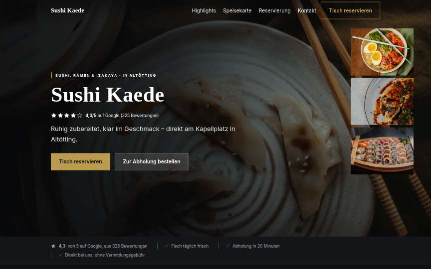 | 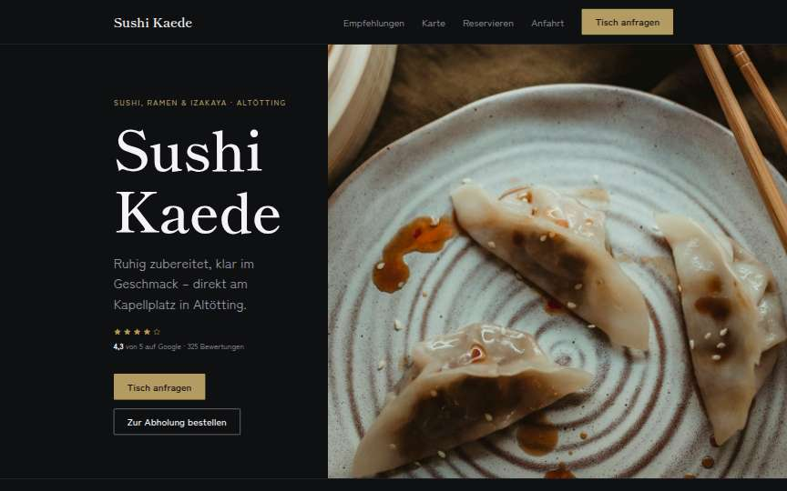 |
| 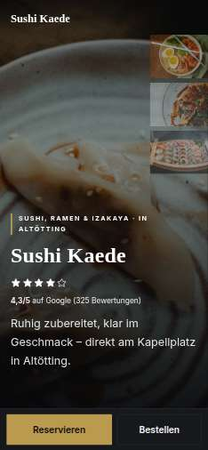 | 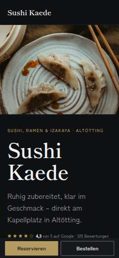 |

Judge-Befunde v1:
  - 2 Farbe(n) außerhalb der Palette: rgb(254,254,255), rgb(255,255,255)
  - 5 Sektion(en) mit Abstand außerhalb der Skala
  - 14 Bedienelement(e) auf dem Handy unter 40px Höhe
  - 1 Bild(er) hochskaliert (unscharf)

### Japanisch · Washitsu

v2: Hell & modern, Zen Old Mincho / Zen Kaku Gothic New, Hero „streifen“, Akzent `#696258`. Judge v1 6.1 ✗ → v2 10.0.

| v1 (vorher) | v2 (nachher) |
|---|---|
| 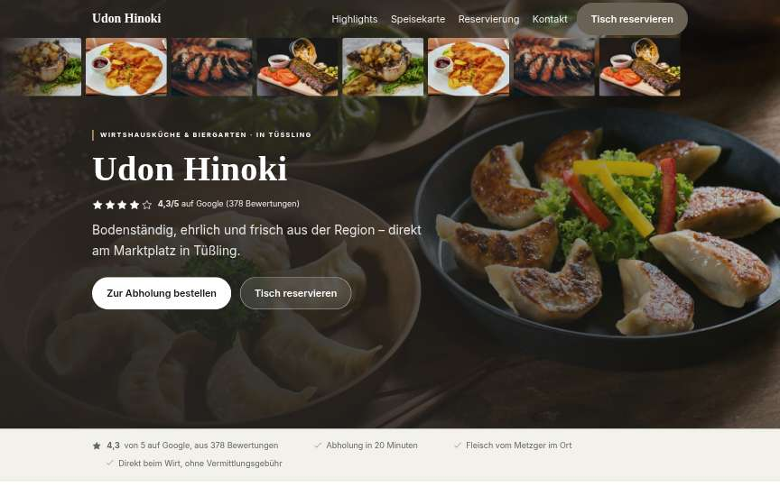 | 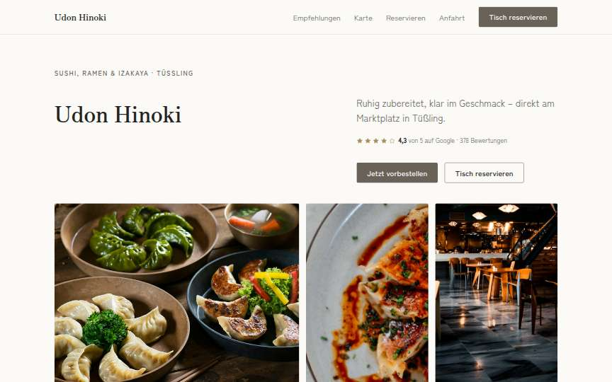 |
| 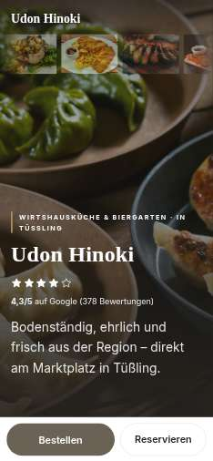 | 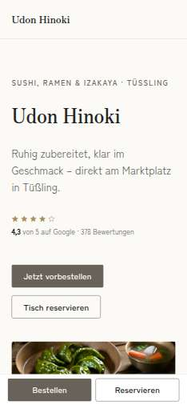 |

Judge-Befunde v1:
  - 1 Farbe(n) außerhalb der Palette: rgb(26,26,26)
  - 4 Text(e) unter WCAG-AA im gerenderten Ergebnis: „Highlights“ 1.04:1, „Speisekarte“ 1.04:1, „Reservierung“ 1.04:1
  - 15 Bedienelement(e) auf dem Handy unter 40px Höhe
  - 1 Bild(er) hochskaliert (unscharf)

### Indisch · Gewürzmarkt

v2: Traditionell, Fjalla One / Libre Franklin, Hero „spalte-bild“, Akzent `#c48227`. Judge v1 5.9 ✗ → v2 10.0.

| v1 (vorher) | v2 (nachher) |
|---|---|
| 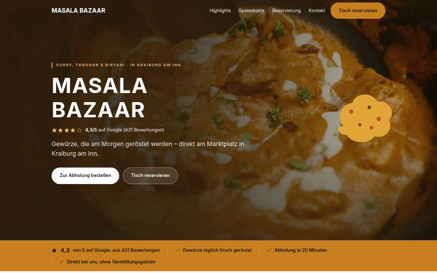 | 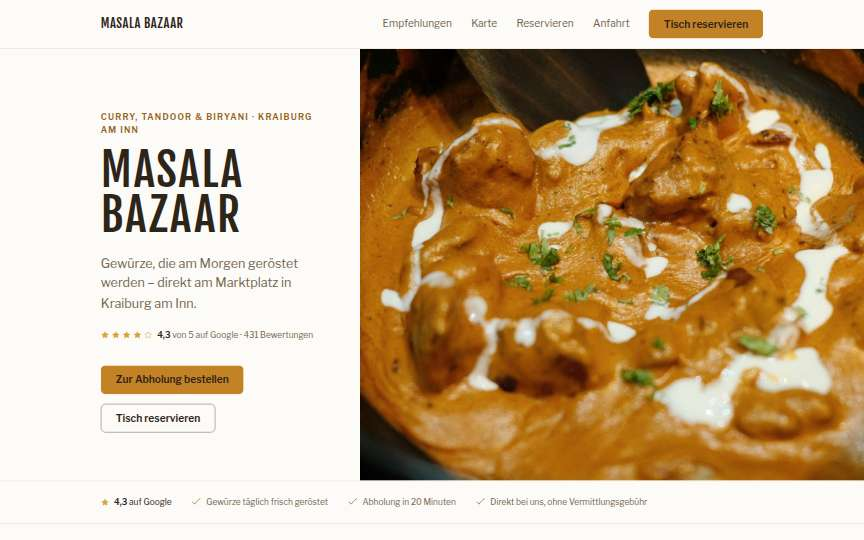 |
| 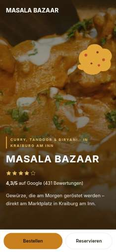 | 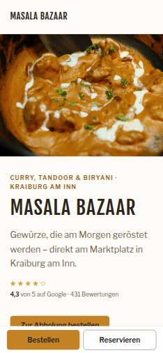 |

Judge-Befunde v1:
  - 1 Farbe(n) außerhalb der Palette: rgb(26,26,26)
  - 4 Text(e) unter WCAG-AA im gerenderten Ergebnis: „Highlights“ 1.03:1, „Speisekarte“ 1.03:1, „Reservierung“ 1.03:1
  - 3 Sektion(en) mit Abstand außerhalb der Skala
  - 16 Bedienelement(e) auf dem Handy unter 40px Höhe

### Indisch · Maharadscha

v2: Abend, Rozha One / Instrument Sans, Hero „typo“, Akzent `#9b4678`. Judge v1 6.1 ✗ → v2 10.0.

| v1 (vorher) | v2 (nachher) |
|---|---|
| 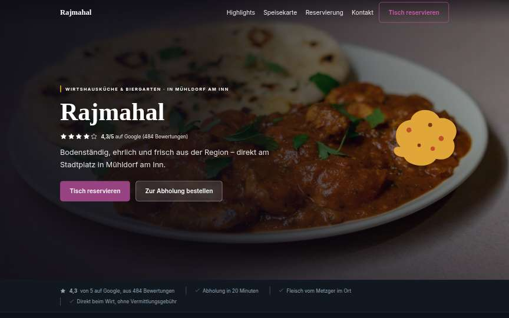 | 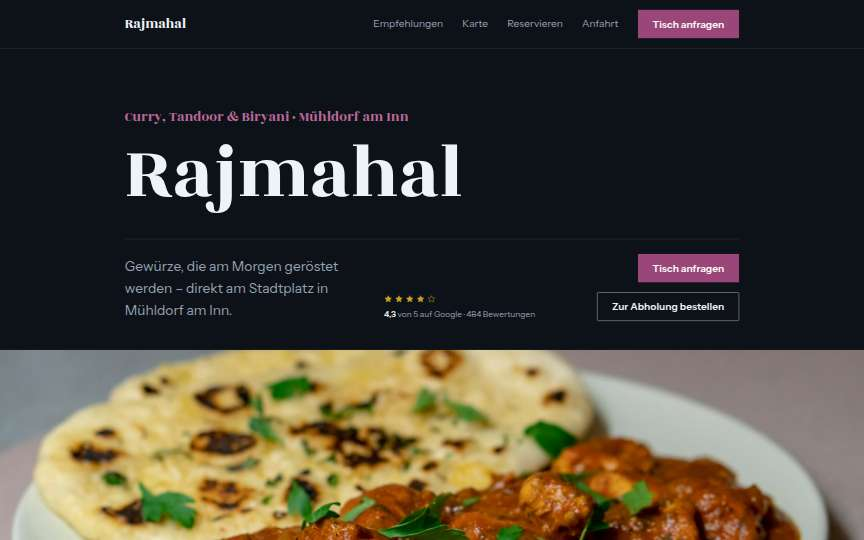 |
| 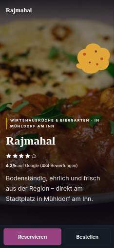 | 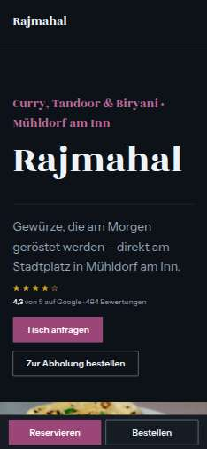 |

Judge-Befunde v1:
  - 5 Sektion(en) mit Abstand außerhalb der Skala
  - 15 Bedienelement(e) auf dem Handy unter 40px Höhe
  - 3 Bild(er) nicht geladen
  - 1 Bild(er) hochskaliert (unscharf)

### Indisch · Südindisch hell

v2: Hell & modern, Literata / Figtree, Hero „streifen“, Akzent `#46833c`. Judge v1 6.1 ✗ → v2 10.0.

| v1 (vorher) | v2 (nachher) |
|---|---|
| 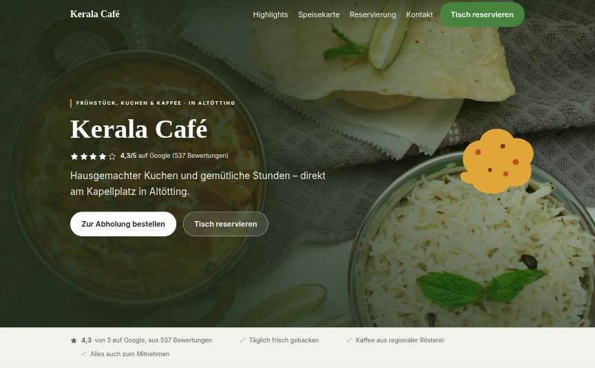 | 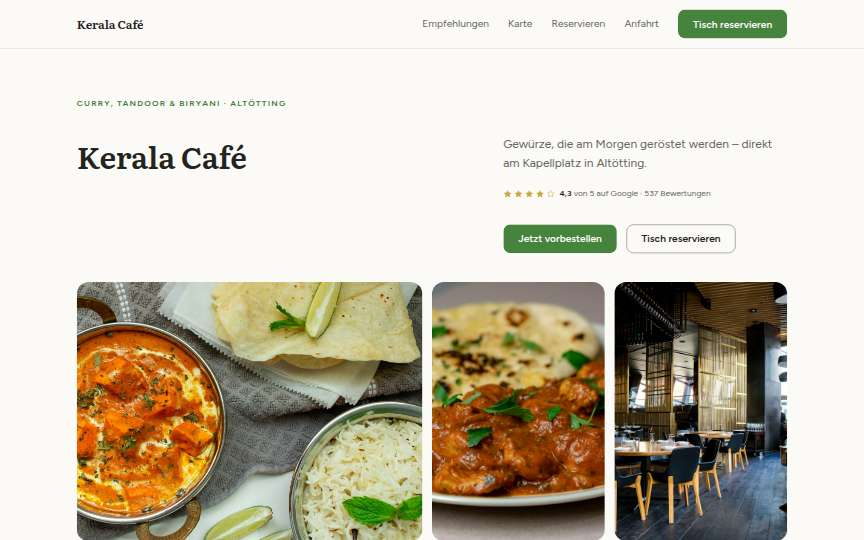 |
| 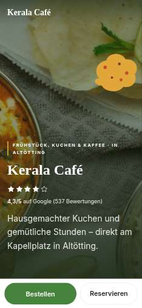 | 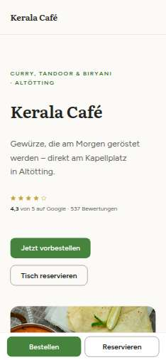 |

Judge-Befunde v1:
  - 1 Farbe(n) außerhalb der Palette: rgb(26,26,26)
  - 4 Text(e) unter WCAG-AA im gerenderten Ergebnis: „Highlights“ 1.04:1, „Speisekarte“ 1.04:1, „Reservierung“ 1.04:1
  - 13 Bedienelement(e) auf dem Handy unter 40px Höhe
  - 1 Bild(er) hochskaliert (unscharf)

### Asiatisch (gemischt) · Marktstand

v2: Traditionell, Archivo Black / Work Sans, Hero „karte“, Akzent `#c85116`. Judge v1 5.9 ✗ → v2 9.4.

| v1 (vorher) | v2 (nachher) |
|---|---|
| 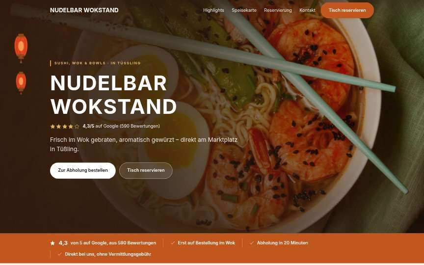 | 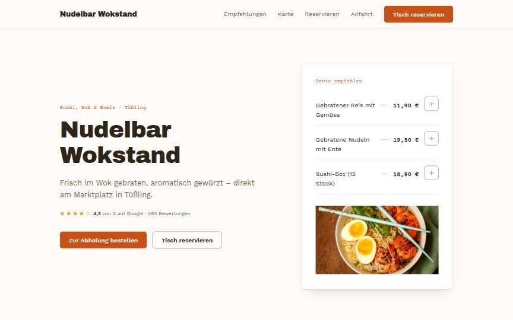 |
| 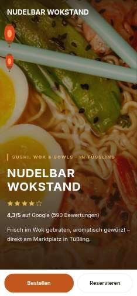 | 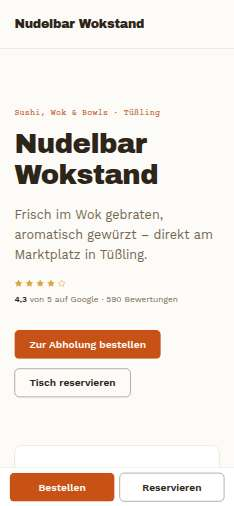 |

Judge-Befunde v1:
  - 1 Farbe(n) außerhalb der Palette: rgb(26,26,26)
  - 4 Text(e) unter WCAG-AA im gerenderten Ergebnis: „Highlights“ 1.03:1, „Speisekarte“ 1.03:1, „Reservierung“ 1.03:1
  - 3 Sektion(en) mit Abstand außerhalb der Skala
  - 15 Bedienelement(e) auf dem Handy unter 40px Höhe

Judge-Befunde v2:
  - Titelbild füllt nur 5 % des ersten Bildschirms

### Asiatisch (gemischt) · Neon

v2: Abend, Saira Extra Condensed / Instrument Sans, Hero „spalte-bild“, Akzent `#d4383b`. Judge v1 6.0 ✗ → v2 10.0.

| v1 (vorher) | v2 (nachher) |
|---|---|
| 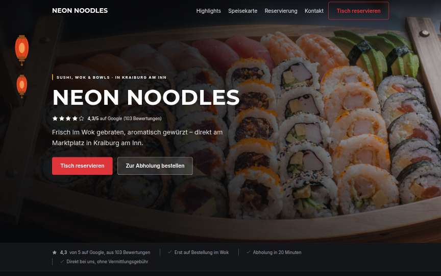 | 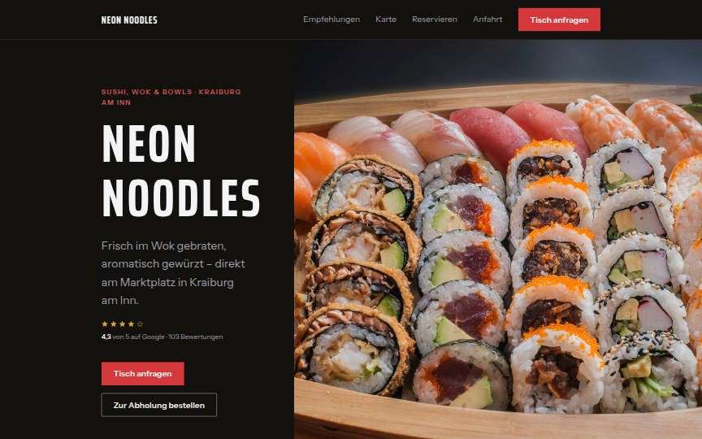 |
| 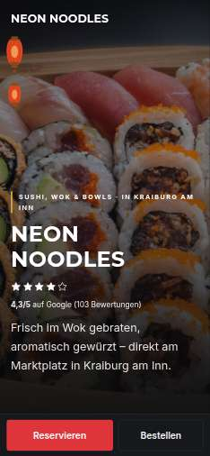 | 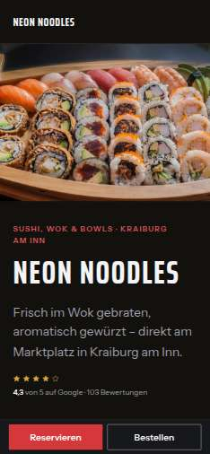 |

Judge-Befunde v1:
  - 5 Sektion(en) mit Abstand außerhalb der Skala
  - 15 Bedienelement(e) auf dem Handy unter 40px Höhe
  - 5 Bild(er) nicht geladen
  - 1 Bild(er) hochskaliert (unscharf)

### Asiatisch (gemischt) · Fusion Minimal

v2: Hell & modern, Instrument Serif / Hanken Grotesk, Hero „spalte-bild“, Akzent `#334754`. Judge v1 6.1 ✗ → v2 10.0.

| v1 (vorher) | v2 (nachher) |
|---|---|
| 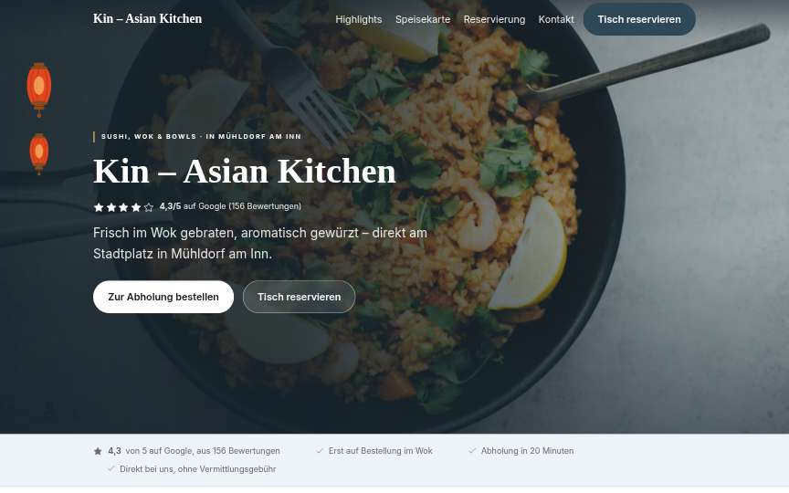 | 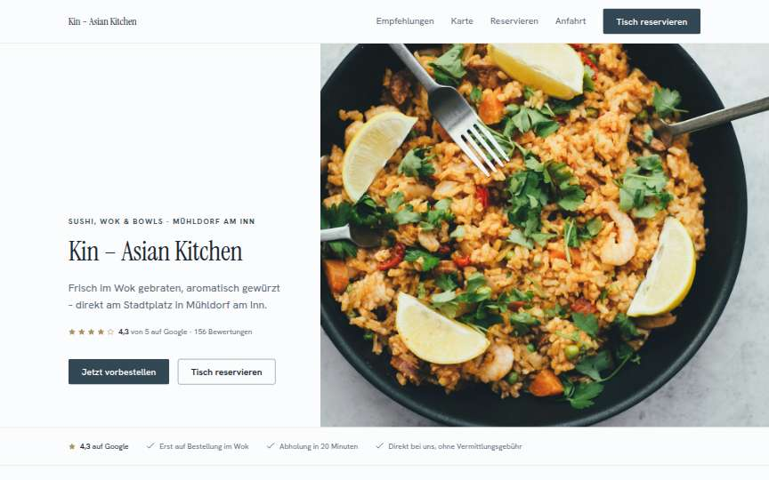 |
| 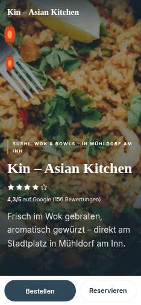 | 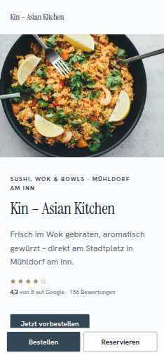 |

Judge-Befunde v1:
  - 1 Farbe(n) außerhalb der Palette: rgb(26,26,26)
  - 4 Text(e) unter WCAG-AA im gerenderten Ergebnis: „Highlights“ 1.03:1, „Speisekarte“ 1.03:1, „Reservierung“ 1.03:1
  - 15 Bedienelement(e) auf dem Handy unter 40px Höhe
  - 1 Bild(er) hochskaliert (unscharf)

### Café · Wiener Kaffeehaus

v2: Traditionell, Old Standard TT / Libre Franklin, Hero „passepartout“, Akzent `#315b4a`. Judge v1 5.9 ✗ → v2 10.0.

| v1 (vorher) | v2 (nachher) |
|---|---|
| 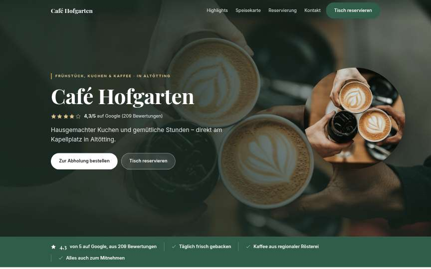 | 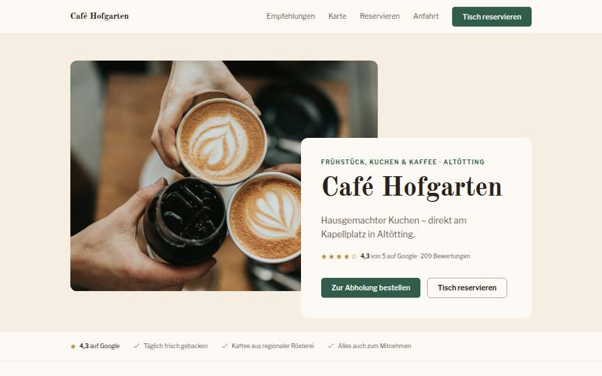 |
| 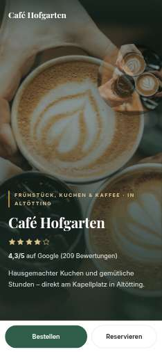 | 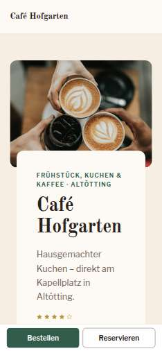 |

Judge-Befunde v1:
  - 1 Farbe(n) außerhalb der Palette: rgb(26,26,26)
  - 4 Text(e) unter WCAG-AA im gerenderten Ergebnis: „Highlights“ 1.04:1, „Speisekarte“ 1.04:1, „Reservierung“ 1.04:1
  - 3 Sektion(en) mit Abstand außerhalb der Skala
  - 13 Bedienelement(e) auf dem Handy unter 40px Höhe

### Café · Konditorei

v2: Abend, Rufina / Karla, Hero „spalte-bild“, Akzent `#b6476b`. Judge v1 5.4 ✗ → v2 10.0.

| v1 (vorher) | v2 (nachher) |
|---|---|
| 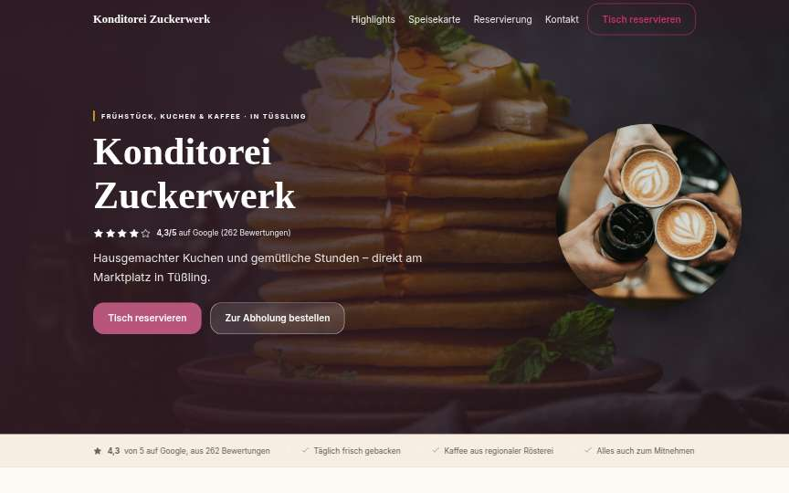 | 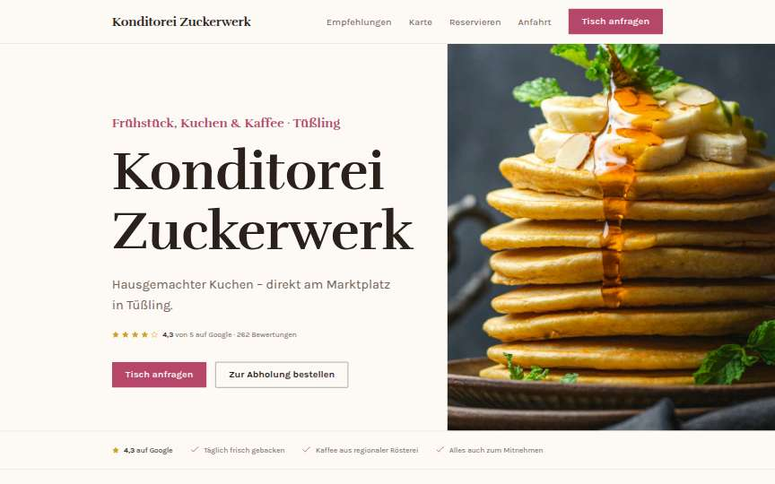 |
|  | 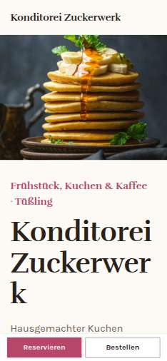 |

Judge-Befunde v1:
  - 4 Text(e) unter WCAG-AA im gerenderten Ergebnis: „Highlights“ 1.04:1, „Speisekarte“ 1.04:1, „Reservierung“ 1.04:1
  - 5 Sektion(en) mit Abstand außerhalb der Skala
  - 13 Bedienelement(e) auf dem Handy unter 40px Höhe
  - 2 Bild(er) nicht geladen

### Café · Third Wave

v2: Hell & modern, Schibsted Grotesk / Karla, Hero „streifen“, Akzent `#5d695c`. Judge v1 6.1 ✗ → v2 10.0.

| v1 (vorher) | v2 (nachher) |
|---|---|
| 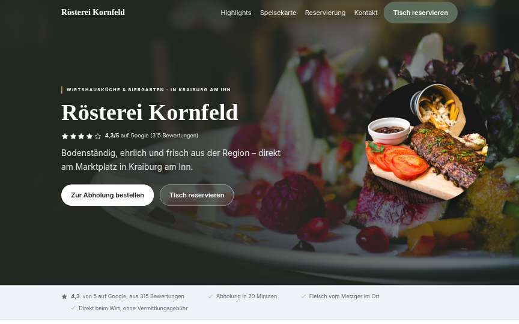 | 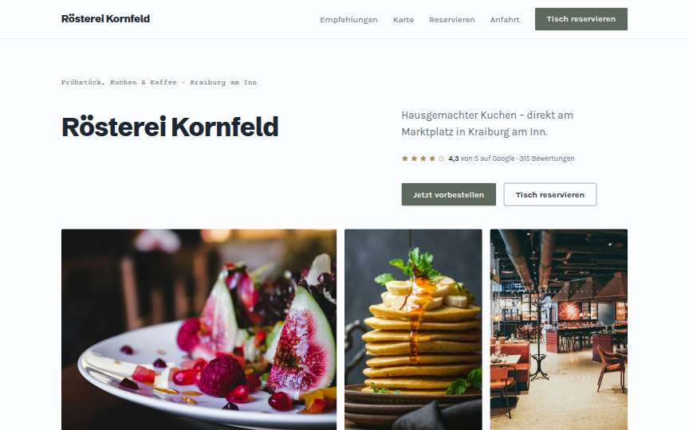 |
| 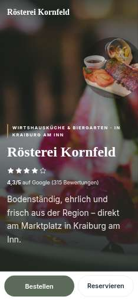 | 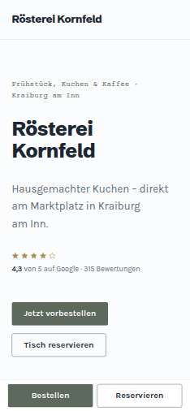 |

Judge-Befunde v1:
  - 1 Farbe(n) außerhalb der Palette: rgb(26,26,26)
  - 4 Text(e) unter WCAG-AA im gerenderten Ergebnis: „Highlights“ 1.03:1, „Speisekarte“ 1.03:1, „Reservierung“ 1.03:1
  - 15 Bedienelement(e) auf dem Handy unter 40px Höhe
  - 1 Bild(er) hochskaliert (unscharf)

